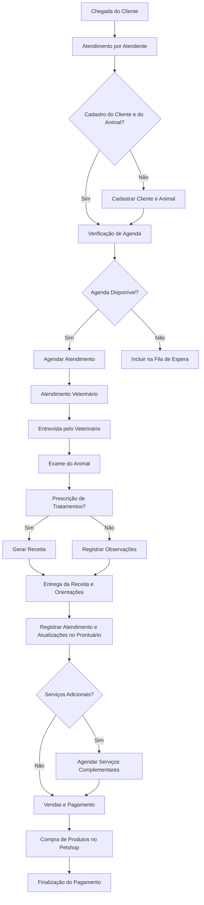
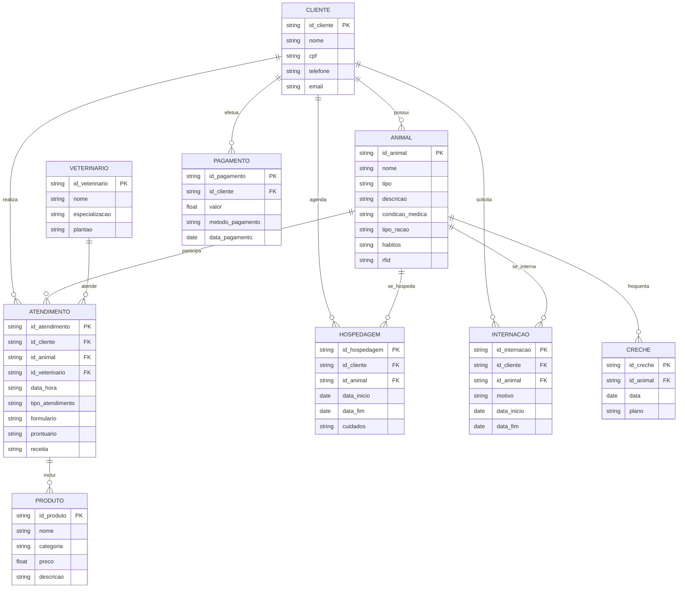
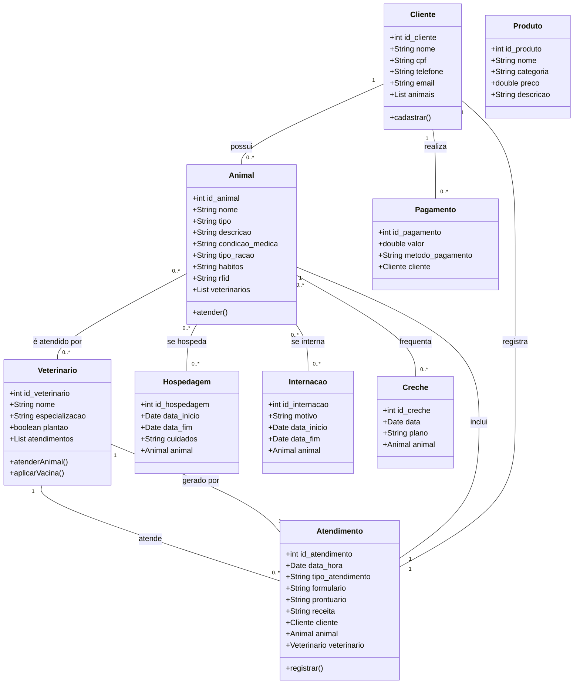
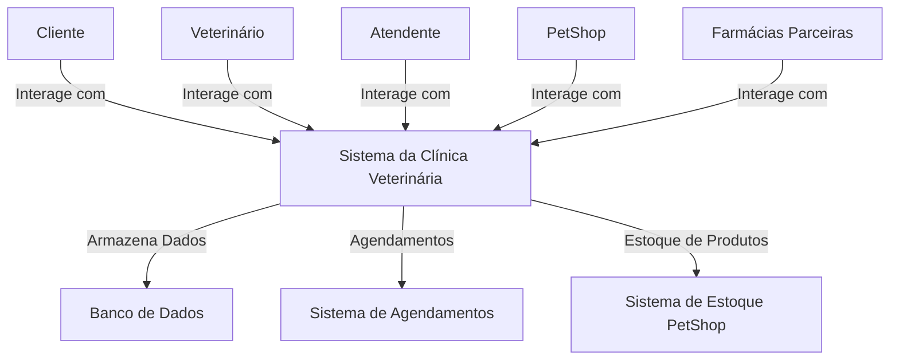
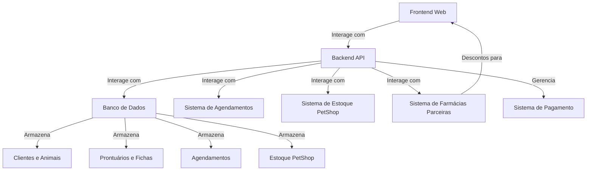
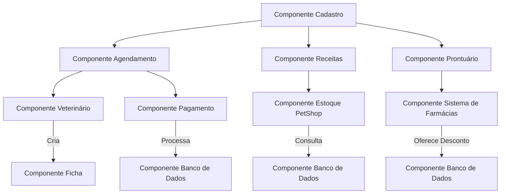
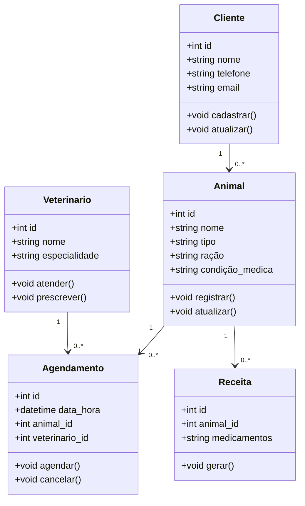
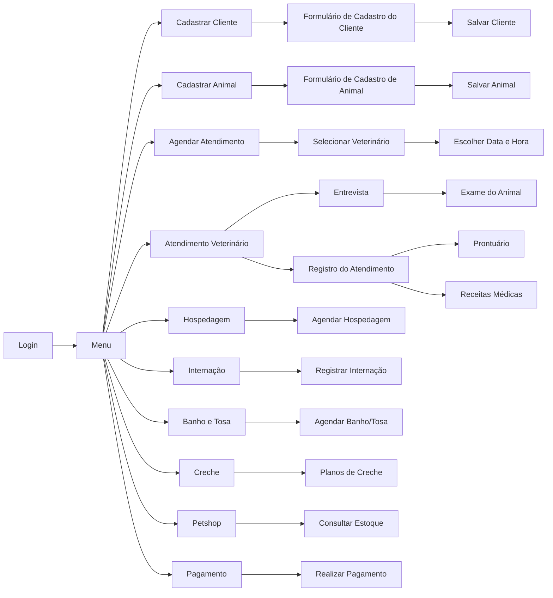
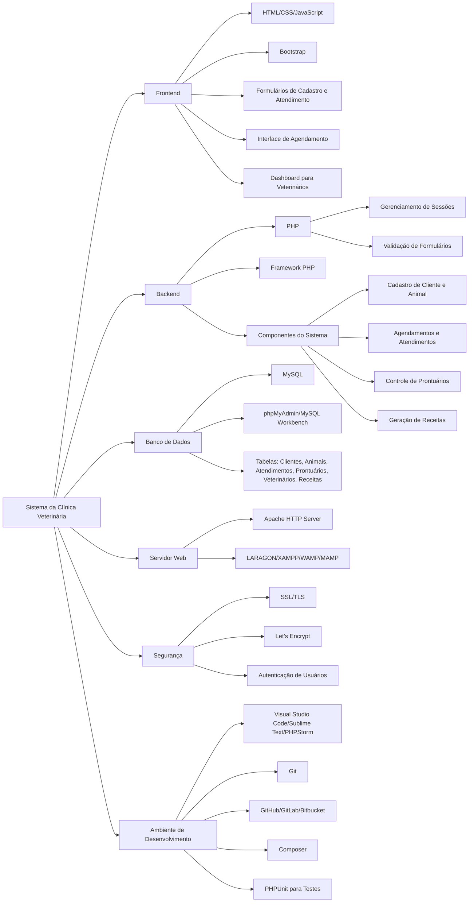

# Camila Weber - Engenharia de Software
---

Disciplina: Engenharia de Software

Discente: Camila Weber

Docente: Emiliano Soares Monteiro

- [Camila Weber - Engenharia de Software](#camila-weber---engenharia-de-software)
- [1. Introdução](#1-introdução)
- [2. Descrição do negócio](#2-descrição-do-negócio)
  - [2.1. Requisitos](#21-requisitos)
- [3. Visão geral do sistema](#3-visão-geral-do-sistema)
  - [3.1. Principais Módulos do Sistema](#31-principais-módulos-do-sistema)
  - [3.2. O que o Sistema Entrega do Ponto de Vista do Usuário Final](#32-o-que-o-sistema-entrega-do-ponto-de-vista-do-usuário-final)
  - [3.3. Diagrama de funcionamento](#33-diagrama-de-funcionamento)
- [4. Diagrama ER](#4-diagrama-er)
  - [4.1. Descrição das Entidades](#41-descrição-das-entidades)
  - [4.2. Descrição dos relacionamentos](#42-descrição-dos-relacionamentos)
- [5. Diagrama de classe](#5-diagrama-de-classe)
  - [5.1. Descrição das Classes](#51-descrição-das-classes)
  - [5.2. Descrição dos relacionamentos](#52-descrição-dos-relacionamentos)
- [6. Casos de uso](#6-casos-de-uso)
  - [6.1. Casos de uso](#61-casos-de-uso)
  - [6.2. Histórias de usuários](#62-histórias-de-usuários)
    - [6.2.1. HU\_01: Cadastro de Cliente e Animal](#621-hu_01-cadastro-de-cliente-e-animal)
    - [6.2.2. HU\_02: Marcação de Atendimento](#622-hu_02-marcação-de-atendimento)
    - [6.2.3. HU\_03: Registro de Condições](#623-hu_03-registro-de-condições)
    - [6.2.4. HU\_04: Atendimento de Emergência](#624-hu_04-atendimento-de-emergência)
    - [6.2.5. HU\_05: Receitas e Orientações](#625-hu_05-receitas-e-orientações)
    - [6.2.6. HU\_06: Ficha e Prontuário do Animal](#626-hu_06-ficha-e-prontuário-do-animal)
    - [6.2.7. HU\_07: Agendamento de Hospedagem](#627-hu_07-agendamento-de-hospedagem)
    - [6.2.8. HU\_08: Serviços de Banho e Tosa](#628-hu_08-serviços-de-banho-e-tosa)
    - [6.2.9. HU\_09: Creche para Animais](#629-hu_09-creche-para-animais)
    - [6.2.10. HU\_10: Compras no Petshop](#6210-hu_10-compras-no-petshop)
    - [6.2.11. HU\_11: Pagamento das Contas](#6211-hu_11-pagamento-das-contas)
- [7. Diagrama de componentes](#7-diagrama-de-componentes)
- [8. Diagrama de Implantação](#8-diagrama-de-implantação)
- [9. Diagrama C4](#9-diagrama-c4)
  - [9.1. Diagrama de Contexto](#91-diagrama-de-contexto)
      - [9.1.1. Descrição do Diagrama de Contexto](#911-descrição-do-diagrama-de-contexto)
  - [9.2. Diagrama de Container](#92-diagrama-de-container)
      - [9.2.1. Descrição do Diagrama de Container](#921-descrição-do-diagrama-de-container)
  - [9.3. Diagrama de Componente](#93-diagrama-de-componente)
      - [9.3.1. Descrição do Diagrama de Componente](#931-descrição-do-diagrama-de-componente)
  - [9.4. Diagrama de Código](#94-diagrama-de-código)
      - [9.4.1. Descrição do Diagrama de Código](#941-descrição-do-diagrama-de-código)
- [10. Protótipo de telas](#10-protótipo-de-telas)
  - [10.1. Tela de Login](#101-tela-de-login)
  - [10.2. Tela de Menu/Abertura](#102-tela-de-menuabertura)
  - [10.3. Tela de Relatório de Clientes](#103-tela-de-relatório-de-clientes)
  - [10.4. Tela de Relatório de Animais](#104-tela-de-relatório-de-animais)
  - [10.5. Tela de Relatório de Veterinários](#105-tela-de-relatório-de-veterinários)
  - [10.6. Tela de Relatório de Hospedagem](#106-tela-de-relatório-de-hospedagem)
  - [10.7. Tela de Relatório de Internação](#107-tela-de-relatório-de-internação)
  - [10.8. Tela de Relatório de Produto](#108-tela-de-relatório-de-produto)
  - [10.9. Tela de Relatório de Creche](#109-tela-de-relatório-de-creche)
  - [10.10. Tela de Relatório de Pagamento](#1010-tela-de-relatório-de-pagamento)
  - [10.11. Tela de Relatório de Atendimento](#1011-tela-de-relatório-de-atendimento)
  - [10.12. Tela de Gráfico](#1012-tela-de-gráfico)
    - [10.12.1. Gráfico Preço dos Produtos](#10121-gráfico-preço-dos-produtos)
  - [10.13. Tela de Dashboard](#1013-tela-de-dashboard)
- [11. Diagrama de navegação de telas](#11-diagrama-de-navegação-de-telas)
- [12. Pilha tecnológica](#12-pilha-tecnológica)
  - [12.1. Descrição do Diagrama da Pilha Tecnológica](#121-descrição-do-diagrama-da-pilha-tecnológica)
- [13. Requisitos de sistemas](#13-requisitos-de-sistemas)
  - [13.1. Requisitos do Cliente](#131-requisitos-do-cliente)
  - [13.2. Requisitos do Servidor](#132-requisitos-do-servidor)
- [14. Considerações sobre Segurança](#14-considerações-sobre-segurança)
  - [14.1. Lado Cliente](#141-lado-cliente)
  - [14.2. Lado Servidor](#142-lado-servidor)
- [15. Manutenção, Instalação e Novas Funcionalidades](#15-manutenção-instalação-e-novas-funcionalidades)
  - [15.1. Manutenção](#151-manutenção)
      - [15.1.1. Objetivo](#1511-objetivo)
  - [15.2. Instalação](#152-instalação)
  - [15.3. Novas Funcionalidades](#153-novas-funcionalidades)
- [16. Treinamento](#16-treinamento)
  - [16.1. Usuário](#161-usuário)
  - [16.2. Administrador do Sistema](#162-administrador-do-sistema)
- [17. Script SQL](#17-script-sql)
  - [17.1. Comandos CREATE table](#171-comandos-create-table)
  - [17.2. Comandos INSERT gerando dados fictícios](#172-comandos-insert-gerando-dados-fictícios)

---
# 1. Introdução

&nbsp;&nbsp;&nbsp;&nbsp;&nbsp;&nbsp;&nbsp; O projeto a seguir apresenta um sistema desenvolvido para um petshop. A empresa é considerada micro e iniciou as atividades recentemente. Ao possuir serviços excluvivos, os sistemas presentes no mercado não se enquadram, desta forma, os proprietários decidiram desenvolver uma solução própria. Esta solução é detalhada nos seguintes tópicos.

[Topo - ⇧](#camila-weber---engenharia-de-software)

---
# 2. Descrição do negócio

Descrição do cenário onde o sistema deverá funcionar:

**1.** Uma clínica veterinária atende apenas os animais: gatos e cachorros.

**2.** Marcar os animais RFID, a pedido do cliente.

**3.** Os clientes devem fazer um cadastro de si, contendo informações pessoais e de contato, e dos animais, como nome e descrições.

**4.** Os clientes devem informar as condições nas quais os animais chegam, para atendimentos com o veterinário, informar se o atendimento é de rotina ou de emergência.

**5.** Os clientes devem informar o tipo de ração que o animal come e se existe alguma condição médica que possa afetar o atendimento.

**6.** O cliente deve informar hábitos do animal.

**7.** Para cada animal é possível que mais de um veterinário o atenda, e um veterinário pode atender mais de um animal.

**8.** Os animais podem chegar e serem atendidos de acordo com uma agenda do dia.

**9.** Os clientes podem marcar um horário com antecedência, podendo escolher o veterinário e não enfrentar filas de atendimento.

**10.** Cada animal atendido receberá uma ficha, contendo as informações de cadastro e outras adicionais, e um prontuário, com registros de consultas, procedimentos e condições médicas.

**11.** Quando necessário o atendimento gera uma receita para o animal, com informações sobre medicamentos, dosagens e horários, além de outras orientações.

**12.** Quando um cliente chega na clínica veterinária ele é atendido por um atendente, que irá efetuar o cadastro do cliente e do animal, caso não esteja no sistema.

**13.** O atendente deve verificar se existe agenda disponível com um veterinário e preencher o horário, se disponível.

**14.** O atendente deve colocar o cliente e seu animal na fila de espera, se for o caso.

**15.** O atendente deve levar o cliente e o animal até o veterinário.

**16.** O veterinário deve realizar uma entrevista com o dono do animal.

**17.** O resultado da entrevista deve ir para um formulário.

**18.** O veterinário deverá examinar o animal e anotar em prontuário(ficha) suas observações.

**19.** Dependendo da situação do animal este receberá uma receita.

**20.** A clínica faz atendimentos médicos de emergência, como cirurgias e curativos para machucados.

**21.** A clínica possui alguns veterinários de plantão durante a madrugada, ficando aberta 24 horas.

**22.** O veterinário pode aplicar vacinas de acordo com o pedido do cliente ou da situação.

**23.** Os atendimentos e as vacinas são agendadas, a não ser em caso de emergência grave, onde um médico de plantão irá atender o animal.

**24.** A clínica oferece serviços de hospedagem, em casos de que o cliente viaje e queira deixar o animal aos cuidados da clínica.

**25.** Para usufruir da hospedagem o cliente tem que agendar a data com pelo menos uma semana de antecedência e informar a data de retorno.

**26.** Durante o período de hospedagem, os animais receberam alimentação e cuidados, além de brincadeiras e caminhadas, tudo supervisionado por funcionários treinados.

**27.** A clínica também oferece a internação, em casos de saúde ou procedimentos cirúrgicos e médicos.

**28.** A clínica conta com uma equipe especializada em cuidados animais, fornecendo banho e tosa, sob agendamento.

**29.** A clínica conta com ambientes de creche, nos quais os animais podem passar o dia sendo supervisionados por funcionarios treinados, são disponibilizados planos mensais/diários para a creche.

**30.** O petshop tem um grande estoque de produtos de higiene, brinquedos e rações das melhores marcas a venda para os clientes.

**31.** O petshop tem parceria com farmácias e oferece descontos para clientes que possuem cadastro.

**32.** O pagamento das da conta pode ser feito em dinheiro, pix e cartões.

**33.** O acesso ao sistema da clínica é feito por meio do login, com nome de usuário e senha.

[Topo - ⇧](#camila-weber---engenharia-de-software)

## 2.1. Requisitos

**Requisitos Funcionais e Não Funcionais**

| **Tipo**                | **Requisito**                                         |
|-------------------------|-------------------------------------------------------|
| **Requisito Funcional** |Cadastro de clientes e animais, com informações pessoais e do animal.    |
|      | Marcação de animais com RFID a pedido do cliente.                        |
|      | Informações sobre as condições de chegada (rotina ou emergência).        |
|      | Informar tipo de ração e condições médicas do animal.                    |
|      | Informar hábitos do animal.                                              |
|      | Agendamento de atendimentos, com escolha do veterinário e horário.       |
|      | Vários veterinários podem atender o mesmo animal e vice-versa.           |
|      | Geração de ficha e prontuário para cada animal atendido.                 |
|      | Geração de receitas com medicamentos, dosagens e orientações.            |
|      | Cadastro de clientes e animais ao chegar na clínica.                     |
|      | Verificação de disponibilidade de agenda pelo atendente.                 |
|      | Colocar clientes e animais na fila de espera, se necessário.             |
|      | Levar cliente e animal até o veterinário.                                |
|      | Veterinário realiza entrevista e registra no formulário.                 |
|      | Veterinário registra exames e observações no prontuário.                 |
|      | Agendamento de vacinas e atendimentos, exceto emergências.               |
|      | Agendamento de serviços como hospedagem, internação e creche.            |
|      | Venda de produtos do petshop com descontos para clientes cadastrados.    |
|      | Processamento de pagamentos por dinheiro, Pix e cartões.                 |
|      | Acesso ao sistema via login com usuário e senha.                         |
|      | Atendimento emergencial disponível 24 horas.                             |
|      | Controle de estoque de produtos petshop.                                 |
| **Requisito Não Funcional** | Baixa latência e alta performance.                |
|      | Segurança dos dados (informações de pagamento e pessoais).               |
|      | Escalabilidade para suportar aumento de usuários e transações.           |
|      | Alta disponibilidade e mínimo de inatividade, especialmente em emergências. |
|      | Interface amigável e de fácil navegação.                                 |
|      | Compatibilidade com diferentes dispositivos e navegadores.               |
|      | Backup regular de dados.                                                 |
|      | Integridade e consistência dos dados.                                    |
|      | Compatibilidade com sistemas de pagamento e segurança nas transações.    |
|      | Relatórios gerenciais sobre atendimentos, estoque e finanças.            |

[Topo - ⇧](#camila-weber---engenharia-de-software)

---
# 3. Visão geral do sistema

&nbsp;&nbsp;&nbsp;&nbsp;&nbsp;&nbsp;&nbsp; O sistema proposto para a clínica veterinária é uma plataforma abrangente que integra diversas funcionalidades voltadas ao atendimento e ao gerenciamento de animais, clientes e serviços. Ele permite o cadastro de clientes e seus animais, agendamento de consultas, gestão de prontuários, geração de receitas, além de oferecer serviços adicionais como hospedagem, internação e creche.

[Topo - ⇧](#camila-weber---engenharia-de-software)

## 3.1. Principais Módulos do Sistema

- **Cadastro de Clientes e Animais**

&nbsp;&nbsp;&nbsp;&nbsp;&nbsp;&nbsp;&nbsp; Os usuários podem criar perfis que contêm informações pessoais dos clientes e dados dos animais, incluindo histórico de saúde e preferências alimentares.

- **Agendamento**

&nbsp;&nbsp;&nbsp;&nbsp;&nbsp;&nbsp;&nbsp; Permite que os clientes marquem atendimentos com veterinários, escolhendo horários e serviços conforme a necessidade (rotina ou emergência).

- **Atendimento Veterinário**

&nbsp;&nbsp;&nbsp;&nbsp;&nbsp;&nbsp;&nbsp; Inclui a realização de entrevistas, exames e anotações em prontuário, além da geração de receitas e orientações pós-atendimento.

- **Serviços Adicionais**

&nbsp;&nbsp;&nbsp;&nbsp;&nbsp;&nbsp;&nbsp; Gerencia a hospedagem, internação, banho e tosa, e creche, proporcionando uma experiência completa para os animais sob cuidados.

- **Venda de Produtos**

&nbsp;&nbsp;&nbsp;&nbsp;&nbsp;&nbsp;&nbsp; Integra um petshop com um amplo estoque de produtos, permitindo que os clientes façam compras diretamente na clínica.

- **Pagamentos**

&nbsp;&nbsp;&nbsp;&nbsp;&nbsp;&nbsp;&nbsp; Oferece opções variadas de pagamento, incluindo dinheiro, pix e cartões, facilitando a transação.

[Topo - ⇧](#camila-weber---engenharia-de-software)

## 3.2. O que o Sistema Entrega do Ponto de Vista do Usuário Final

- **Acesso Rápido a Serviços**

&nbsp;&nbsp;&nbsp;&nbsp;&nbsp;&nbsp;&nbsp; O sistema oferece uma interface amigável que permite aos usuário agendar consultas e serviços para os clientes de forma eficiente e intuitiva.

- **Atendimento Personalizado**

&nbsp;&nbsp;&nbsp;&nbsp;&nbsp;&nbsp;&nbsp; Cada animal é tratado de forma única, com informações detalhadas coletadas e registradas, o que resulta em um atendimento mais adequado às suas necessidades.

- **Histórico Completo de Saúde**

&nbsp;&nbsp;&nbsp;&nbsp;&nbsp;&nbsp;&nbsp; Os clientes têm acesso a prontuários completos, que documentam todas as consultas, tratamentos e observações, permitindo um acompanhamento contínuo da saúde dos animais.

- **Flexibilidade de Agendamento**

&nbsp;&nbsp;&nbsp;&nbsp;&nbsp;&nbsp;&nbsp; A possibilidade de agendar atendimentos com antecedência, escolhendo veterinários e horários, proporciona comodidade e evita filas.

- **Serviços de Emergência**

&nbsp;&nbsp;&nbsp;&nbsp;&nbsp;&nbsp;&nbsp; O sistema garante atendimento imediato em situações de emergência, com veterinários disponíveis 24 horas, assegurando cuidados urgentes quando necessário.

- **Cuidado e Conforto Durante a Hospedagem**

&nbsp;&nbsp;&nbsp;&nbsp;&nbsp;&nbsp;&nbsp; Clientes podem agendar a hospedagem de seus animais, com a certeza de que receberão cuidados adequados, alimentação e atividades recreativas.

- **Facilidade de Compras**

&nbsp;&nbsp;&nbsp;&nbsp;&nbsp;&nbsp;&nbsp; A integração com o petshop permite que os clientes adquiram produtos essenciais durante suas visitas, simplificando o processo de compra.

- **Descontos e Benefícios**

&nbsp;&nbsp;&nbsp;&nbsp;&nbsp;&nbsp;&nbsp; O sistema oferece acesso a descontos em farmácias para clientes cadastrados, proporcionando vantagens adicionais.

- **Variedade nos Métodos de Pagamento**

&nbsp;&nbsp;&nbsp;&nbsp;&nbsp;&nbsp;&nbsp; A aceitação de diferentes formas de pagamento garante que os clientes possam realizar transações de forma prática e conveniente.

- **Experiência Geral Positiva**

&nbsp;&nbsp;&nbsp;&nbsp;&nbsp;&nbsp;&nbsp; A combinação de funcionalidades robustas e uma interface amigável resulta em uma experiência de usuário satisfatória, fortalecendo a relação entre a clínica e seus clientes.

[Topo - ⇧](#camila-weber---engenharia-de-software)

## 3.3. Diagrama de funcionamento



[Topo - ⇧](#camila-weber---engenharia-de-software)

---
# 4. Diagrama ER



[Topo - ⇧](#camila-weber---engenharia-de-software)

## 4.1. Descrição das Entidades

> **CLIENTE**: Representa os clientes da clínica, incluindo informações pessoais e de contato.
> 
> **ANIMAL**: Registra os animais cadastrados, com detalhes sobre nome, tipo, condições médicas e hábitos.
> 
> **Veterinário**: Contém informações sobre os veterinários, incluindo especializações e horários de plantão.
> 
> **ATENDIMENTO**: Relaciona os atendimentos realizados, incluindo informações sobre o cliente, animal, veterinário, tipo de atendimento e documentação gerada (prontuário, receita).
> 
> **HOSPEDAGEM**: Informações sobre os períodos em que os animais ficam hospedados na clínica.
> 
> **INTERNAÇÃO**: Registra informações sobre internações de animais, incluindo motivos e períodos.
> 
> **CRECHE**: Detalha as atividades e planos para animais que frequentam a creche da clínica.
> 
> **PRODUTO**: Representa os produtos disponíveis para venda na clínica.
> 
> **PAGAMENTO**: Contém informações sobre os pagamentos realizados pelos clientes.

[Topo - ⇧](#camila-weber---engenharia-de-software)

## 4.2. Descrição dos relacionamentos

>**CLIENTE** pode ter vários **ANIMAL**s.
>
>**CLIENTE** pode realizar vários **ATENDIMENTO**s.
>
>**CLIENTE** pode agendar várias **HOSPEDAGEM**s.
>
>**CLIENTE** pode solicitar várias **INTERNAÇÃO**s.
>
>**CLIENTE** pode efetuar vários **PAGAMENTO**s.
>
>**ANIMAL** pode participar de vários **ATENDIMENTO**s.
>
>**ANIMAL** pode se hospedar em várias **HOSPEDAGEM**s.
>
>**ANIMAL** pode ser internado em várias **INTERNAÇÃO**s.
>
>**ANIMAL** pode frequentar a **CRECHE** em diferentes ocasiões.
>
>**Veterinário** pode atender a vários **ATENDIMENTO**s.
>
>**ATENDIMENTO** pode incluir vários **PRODUTO**s.

[Topo - ⇧](#camila-weber---engenharia-de-software)

---
# 5. Diagrama de classe



[Topo - ⇧](#camila-weber---engenharia-de-software)

## 5.1. Descrição das Classes

> **Cliente**: Representa os clientes da clínica, com métodos para cadastrar clientes e gerenciar seus animais.
> 
> **Animal**: Contém informações sobre os animais, como tipo e descrição, e métodos para gerenciar atendimentos.
> 
> **Veterinário**: Armazena dados sobre os veterinários e seus métodos de atendimento e aplicação de vacinas.
> 
> **Atendimento**: Registra informações sobre os atendimentos realizados, incluindo clientes, animais e veterinários.
> 
> **Hospedagem**: Representa serviços de hospedagem para animais.
> 
> **Internação**: Armazena informações sobre internações de animais.
> 
> **Creche**: Detalha atividades dos animais na creche.
> 
> **Produto**: Representa os produtos disponíveis para venda na clínica.
> 
> **Pagamento**: Armazena informações sobre os pagamentos realizados pelos clientes.

[Topo - ⇧](#camila-weber---engenharia-de-software)

## 5.2. Descrição dos relacionamentos

>**Cliente** pode ter vários **Animal**s.
>
>**Veterinário** pode atender a vários **Atendimento**s.
>
>**Animal** pode ser atendido por vários **Veterinário**s.
>
>**Atendimento** é registrado para um único **Cliente**.
>
>**Atendimento** inclui um único **Animal.
>
>**Atendimento** é gerado por um único **Veterinário**.
>
>**Animal** pode se hospedar em várias **Hospedagem**s.
>
>**Animal** pode ser internado em várias **Internação**s.
>
>**Animal** pode frequentar a **Creche** em várias ocasiões.
>
>**Cliente** pode realizar vários **Pagamento**s.

[Topo - ⇧](#camila-weber---engenharia-de-software)

---
# 6. Casos de uso

## 6.1. Casos de uso


[Topo - ⇧](#camila-weber---engenharia-de-software)

## 6.2. Histórias de usuários

### 6.2.1. HU_01: Cadastro de Cliente e Animal

> **Como** um cliente,  
> **quero** cadastrar minhas informações e as do meu animal,  
> **para** que eu possa agendar atendimentos e receber cuidados adequados.

- **Critérios de aceitação**
    - O cliente pode inserir seu nome, endereço e telefone.
    - O sistema deve armazenar essas informações e associá-las ao cliente.
    - O cliente pode inserir o nome, tipo (gato ou cachorro), condição, tipo de ração e hábitos do animal.
    - O sistema deve associar o animal ao cliente que o cadastrou.

### 6.2.2. HU_02: Marcação de Atendimento

> **Como** um cliente,  
> **quero** marcar um horário com antecedência,  
> **para** que eu possa escolher o veterinário e evitar filas.

- **Critérios de aceitação**
    - O cliente pode visualizar a disponibilidade de veterinários.
    - O cliente pode escolher um veterinário e um horário para o atendimento com a atendente, pessoalmente ou pelo número da clínica.
    - O sistema deve confirmar o agendamento e enviar uma notificação ao cliente.

### 6.2.3. HU_03: Registro de Condições

> **Como** um cliente,  
> **quero** informar as condições de saúde do meu animal e seus hábitos,  
> **para** que o veterinário possa oferecer um atendimento adequado.

- **Critérios de aceitação**
    - O cliente pode informar as condições de saúde do animal e seus hábitos durante o cadastro ou atualização do perfil.
    - Essas informações devem ser armazenadas no perfil do animal e estar acessíveis ao veterinário durante o atendimento.

### 6.2.4. HU_04: Atendimento de Emergência

> **Como** um cliente,  
> **quero** saber que posso levar meu animal para atendimento de emergência a qualquer hora,  
> **para** que ele receba os cuidados necessários rapidamente.

- **Critérios de aceitação**
    - O cliente deve ser informado sobre a disponibilidade de atendimento de emergência.
    - O sistema deve permitir que o cliente registre a entrada do animal para atendimento de emergência a qualquer hora.

### 6.2.5. HU_05: Receitas e Orientações

> **Como** um veterinário,  
> **quero** gerar receitas com informações detalhadas após o atendimento,  
> **para** que os clientes possam seguir corretamente as orientações de cuidado.

- **Critérios de aceitação**
    - O veterinário deve poder gerar receitas detalhadas após o atendimento.
    - As receitas devem ser armazenadas no sistema e enviadas ao cliente, para o número contido no registro.
    - O cliente deve poder visualizar e imprimir as orientações de cuidado.

### 6.2.6. HU_06: Ficha e Prontuário do Animal

> **Como** um veterinário,  
> **quero** registrar todas as informações e observações em uma ficha,  
> **para** que haja um histórico completo do atendimento do animal.

- **Critérios de aceitação**
    - O veterinário deve registrar todas as informações e observações na ficha do animal após cada atendimento.
    - O sistema deve manter um histórico completo do atendimento do animal, acessível para consulta futura.

### 6.2.7. HU_07: Agendamento de Hospedagem

> **Como** um cliente,  
> **quero** agendar a hospedagem do meu animal com uma semana de antecedência,  
> **para** que eu possa viajar tranquilo, sabendo que ele está bem cuidado.

- **Critérios de aceitação**
    - O cliente pode visualizar a disponibilidade de hospedagem para seu animal.
    - O cliente pode agendar a hospedagem com pelo menos uma semana de antecedência com a atendente, pessoalmente ou pelo número da clínica.
    - O sistema deve confirmar a reserva e enviar uma notificação ao cliente.

### 6.2.8. HU_08: Serviços de Banho e Tosa

> **Como** um cliente,  
> **quero** agendar serviços de banho e tosa,  
> **para** que meu animal possa ficar limpo e bem cuidado.

- **Critérios de aceitação**
    - O cliente pode visualizar a disponibilidade para serviços de banho e tosa.
    - O cliente pode agendar um horário para o serviço com a atendente, pessoalmente ou pelo número da clínica.
    - O sistema deve confirmar o agendamento e enviar uma notificação ao cliente.

### 6.2.9. HU_09: Creche para Animais

> **Como** um cliente,  
> **quero** inscrever meu animal na creche,  
> **para** que ele tenha companhia e cuidados durante o dia.

- **Critérios de aceitação**
    - O cliente pode inscrever seu animal na creche.
    - O sistema deve registrar a inscrição e os dias de frequência.
    - O cliente deve ser notificado sobre o status da inscrição.

### 6.2.10. HU_10: Compras no Petshop

> **Como** um cliente,  
> **quero** comprar produtos de higiene e ração no petshop da clínica,  
> **para** que eu possa encontrar tudo o que preciso em um só lugar.

- **Critérios de aceitação**
    - O cliente pode visualizar e escolher os produtos disponíveis no petshop da clínica.
    - O cliente pode comprar pessoalmente ou encomendar pelo número da clínica.
    - O sistema deve confirmar a compra e enviar um recibo ao cliente.

### 6.2.11. HU_11: Pagamento das Contas

> **Como** um cliente,  
> **quero** ter opções de pagamento como dinheiro, pix e cartões,  
> **para** que eu possa escolher a forma que for mais conveniente para mim.

- **Critérios de aceitação**
    - O cliente deve ter opções de pagamento como dinheiro, pix e cartões durante o checkout.
    - O sistema deve processar o pagamento e confirmar a transação.
    - O cliente deve receber um comprovante de pagamento.

[Topo - ⇧](#camila-weber---engenharia-de-software)

---
# 7. Diagrama de componentes


[Topo - ⇧](#camila-weber---engenharia-de-software)

---
# 8. Diagrama de Implantação


[Topo - ⇧](#camila-weber---engenharia-de-software)

---
# 9. Diagrama C4

## 9.1. Diagrama de Contexto



#### 9.1.1. Descrição do Diagrama de Contexto

>**Cliente**: Cadastro e agendamento de serviços (consultas, hospedagem, creche, etc.).
>
>**Veterinário**: Acesso a prontuários, atendimento, receitas e exames dos animais.
>
>**Atendente**: Responsável por cadastro e agendamento de serviços.
>
>**PetShop**: Sistema de gerenciamento de produtos de higiene, brinquedos, rações, etc.
>
>**Farmácias Parceiras**: Oferecem descontos para clientes com cadastro.
>
>**Banco de Dados**: Armazena todas as informações relacionadas aos clientes, animais, prontuários e agendamentos.
>
>**Sistema de Agendamentos**: Gerencia os horários e disponibilidade dos atendimentos veterinários.
>
>**Sistema de Estoque PetShop**: Gerencia o estoque de produtos para venda.

[Topo - ⇧](#camila-weber---engenharia-de-software)

## 9.2. Diagrama de Container



#### 9.2.1. Descrição do Diagrama de Container

>**Frontend Web**: Interface do usuário para acessar o sistema, incluindo clientes, veterinários, atendentes, e administradores.
>
>**Backend API**: Processa as requisições do frontend, lida com a lógica de negócios e interage com os containers abaixo.
>
>**Banco de Dados**: Armazena dados persistentes, como clientes, animais, prontuários, agendamentos e estoque.
>
>**Sistema de Agendamentos**: Gerencia o calendário de atendimentos e disponibilidades.
>
>**Sistema de Estoque PetShop**: Gerencia o inventário de produtos para venda.
>
>**Sistema de Farmácias Parceiras**: Gerencia descontos de farmácias para clientes cadastrados.
>
>**Sistema de Pagamento**: Processa pagamentos via Pix, cartão e dinheiro.

[Topo - ⇧](#camila-weber---engenharia-de-software)

## 9.3. Diagrama de Componente



#### 9.3.1. Descrição do Diagrama de Componente

>**Componente Cadastro**: Gerencia cadastro de clientes e animais, incluindo informações pessoais, condições médicas, hábitos e tipo de alimentação.
>
>**Componente Agendamento**: Gerencia agendamento de consultas e outros serviços, como hospedagem e creche.
>
>**Componente Receitas**: Emite receitas para os animais, com medicamentos e orientações.
>
>**Componente Prontuário**: Registra os prontuários médicos dos animais, incluindo históricos de atendimentos e exames.
>
>**Componente Veterinário**: Registra o atendimento e cria fichas para os animais, incluindo diagnósticos e prescrições.
>
>**Componente Pagamento**: Processa os pagamentos dos clientes pelos serviços prestados.
>
>**Componente Estoque PetShop**: Gerencia o estoque de produtos vendidos pela clínica.
>
>**Componente Sistema de Farmácias**: Gerencia os descontos e benefícios de farmácias parceiras para clientes cadastrados.
>
>**Componente Banco de Dados**: Armazena e acessa dados persistentes, como registros de clientes, animais, prontuários e agendamentos.

[Topo - ⇧](#camila-weber---engenharia-de-software)

## 9.4. Diagrama de Código



#### 9.4.1. Descrição do Diagrama de Código

>**Classe Cliente**: Contém as informações pessoais do cliente, como nome, telefone, e-mail, e métodos para cadastrar e atualizar.
>
>**Classe Animal**: Contém informações sobre o animal, como nome, tipo, ração e condições médicas, e métodos para registrar e atualizar.
>
>**Classe Agendamento**: Gerencia os agendamentos, associando um animal e veterinário a uma data e horário, com métodos para agendar e cancelar.
>
>**Classe Veterinário**: Contém as informações sobre o veterinário e seus métodos para atender animais e prescrever tratamentos.
>
>**Classe Receita**: Registra as receitas médicas para o animal, com informações sobre os medicamentos e suas dosagens.

[Topo - ⇧](#camila-weber---engenharia-de-software)

---
# 10. Protótipo de telas

## 10.1. Tela de Login


[Topo - ⇧](#camila-weber---engenharia-de-software)

## 10.2. Tela de Menu/Abertura


[Topo - ⇧](#camila-weber---engenharia-de-software)

## 10.3. Tela de Relatório de Clientes


[Topo - ⇧](#camila-weber---engenharia-de-software)

## 10.4. Tela de Relatório de Animais


[Topo - ⇧](#camila-weber---engenharia-de-software)


[Topo - ⇧](#camila-weber---engenharia-de-software)

## 10.5. Tela de Relatório de Veterinários


[Topo - ⇧](#camila-weber---engenharia-de-software)

## 10.6. Tela de Relatório de Hospedagem


[Topo - ⇧](#camila-weber---engenharia-de-software)

## 10.7. Tela de Relatório de Internação


[Topo - ⇧](#camila-weber---engenharia-de-software)

## 10.8. Tela de Relatório de Produto


[Topo - ⇧](#camila-weber---engenharia-de-software)

## 10.9. Tela de Relatório de Creche


[Topo - ⇧](#camila-weber---engenharia-de-software)

## 10.10. Tela de Relatório de Pagamento


[Topo - ⇧](#camila-weber---engenharia-de-software)

## 10.11. Tela de Relatório de Atendimento


[Topo - ⇧](#camila-weber---engenharia-de-software)

## 10.12. Tela de Gráfico

### 10.12.1. Gráfico Preço dos Produtos


[Topo - ⇧](#camila-weber---engenharia-de-software)

## 10.13. Tela de Dashboard


[Topo - ⇧](#camila-weber---engenharia-de-software)

---
# 11. Diagrama de navegação de telas



[Topo - ⇧](#camila-weber---engenharia-de-software)

---
# 12. Pilha tecnológica



[Topo - ⇧](#camila-weber---engenharia-de-software)

## 12.1. Descrição do Diagrama da Pilha Tecnológica

> **Sistema da Clínica Veterinária**

&nbsp;&nbsp;&nbsp;&nbsp;&nbsp;&nbsp;&nbsp; O sistema é projetado para gerenciar os diversos aspectos da operação de uma clínica veterinária, abrangendo desde o cadastro de clientes e animais até o agendamento de atendimentos e gestão de prontuários.

> **Frontend**

&nbsp;&nbsp;&nbsp;&nbsp;&nbsp;&nbsp;&nbsp; O frontend é a interface do usuário, onde os clientes e funcionários interagem com o sistema. Os principais componentes incluem:

- **HTML/CSS/JavaScript**: Tecnologias básicas para construir a estrutura e o estilo da aplicação.
- **Bootstrap**: Framework para design responsivo, permitindo que o sistema seja acessível em diferentes dispositivos.
- **Formulários de Cadastro e Atendimento**: Interfaces para que os clientes possam cadastrar suas informações e solicitar atendimentos.
- **Interface de Agendamento**: Funcionalidade para agendar consultas e serviços com veterinários.
- **Dashboard para Veterinários**: Painel para que os veterinários visualizem suas agendas, atendimentos e prontuários dos animais.
  
> **Backend**

&nbsp;&nbsp;&nbsp;&nbsp;&nbsp;&nbsp;&nbsp; O backend é responsável pela lógica de negócio e pela manipulação de dados. Ele inclui:

- **PHP**: Linguagem de programação principal usada para desenvolver a lógica do sistema.
- **Framework PHP**: Facilita o desenvolvimento, proporcionando ferramentas e estruturas que agilizam a criação de aplicações.
- **Componentes do Sistema**: Módulos que gerenciam funcionalidades específicas, como cadastro, agendamentos e prontuários.
- **Gerenciamento de Sessões**: Controla as sessões de usuários para autenticação e segurança.
- **Validação de Formulários**: Garante que os dados inseridos pelos usuários sejam válidos e seguros.
- **Cadastro de Cliente e Animal**: Módulo específico para registrar clientes e seus animais.
- **Agendamentos e Atendimentos**: Gestão de consultas agendadas e atendimentos realizados.
- **Controle de Prontuários**: Armazena e gerencia o histórico médico de cada animal.
- **Geração de Receitas**: Módulo que cria receitas para tratamentos prescritos.

> **Banco de Dados**

&nbsp;&nbsp;&nbsp;&nbsp;&nbsp;&nbsp;&nbsp; O banco de dados é fundamental para armazenar informações essenciais:

- **MySQL**: Sistema de gerenciamento de banco de dados relacional utilizado para armazenar os dados.
- **phpMyAdmin/MySQL Workbench**: Ferramentas para facilitar a gestão e a visualização dos dados.
- **Tabelas**: Estruturas que organizam os dados, incluindo tabelas para Clientes, Animais, Atendimentos, Prontuários, Veterinários e Receitas.

> **Servidor Web**

&nbsp;&nbsp;&nbsp;&nbsp;&nbsp;&nbsp;&nbsp; O servidor web hospeda a aplicação e a torna acessível aos usuários:

- **Apache HTTP Server**: O servidor utilizado para servir a aplicação web.
- **LARAGON/XAMPP/WAMP/MAMP**: Pacotes de software que incluem Apache, MySQL e PHP, facilitando a configuração do ambiente de desenvolvimento.

> **Segurança**

&nbsp;&nbsp;&nbsp;&nbsp;&nbsp;&nbsp;&nbsp; Medidas de segurança são implementadas para proteger os dados e as comunicações:

- **SSL/TLS**: Protocolos que garantem a criptografia das informações transmitidas entre o usuário e o servidor.
- **Let’s Encrypt**: Serviço para emissão de certificados SSL gratuitos, garantindo segurança na comunicação.
- **Autenticação de Usuários**: Mecanismos para garantir que apenas usuários autorizados possam acessar o sistema.

> **Ambiente de Desenvolvimento**

&nbsp;&nbsp;&nbsp;&nbsp;&nbsp;&nbsp;&nbsp; O ambiente de desenvolvimento é essencial para os programadores que trabalham no sistema:

- **Visual Studio Code/Sublime Text/PHPStorm**: Editores de código utilizados para programar a aplicação.
- **Git**: Sistema de controle de versão que ajuda a gerenciar alterações no código.
- **GitHub/GitLab/Bitbucket**: Plataformas para hospedagem de repositórios Git, facilitando a colaboração entre desenvolvedores.
- **Composer**: Gerenciador de dependências para PHP, simplificando a instalação e atualização de bibliotecas.
- **PHPUnit para Testes**: Framework utilizado para realizar testes automatizados na aplicação, assegurando a qualidade do código.

[Topo - ⇧](#camila-weber---engenharia-de-software)

---
# 13. Requisitos de sistemas

## 13.1. Requisitos do Cliente

&nbsp;&nbsp;&nbsp;&nbsp;&nbsp;&nbsp;&nbsp; Para que o cliente tenha acesso à aplicação e consiga utilizá-la de maneira adequada, ele precisará atender aos seguintes requisitos:

> **Sistema Operacional**

- A aplicação é compatível com os seguintes sistemas operacionais, é de preferência que o cliente utilize um deles:
  - Para PC:
      - Windows
      - macOS
      - Linux
  - Para Mobile:
      - Android
      - iOS

> **Navegadores Compatíveis**

- A aplicação pode ser acessada através de navegadores modernos, como:
  - Google Chrome
  - Mozilla Firefox
  - Safari
  - Microsoft Edge

> **Acesso à Internet**

- Como o acesso a aplicação é por meio de navegadores é recomendado uma conexão à internet estável, com largura de banda mínima recomendada de 800 Mbps para um desempenho adequado.
- Se o cliente preferir pode ter dois pontos de internet de diferentes provedores, para garantir uma redundância da conexão de internet.

> **Recursos de Hardware**

- Dispositivos compatíveis devem ter as seguintes especificações mínimas:
  - **PC:**
    - Processador: 4 GHz ou superior
    - Memória RAM: 8 GB ou mais
    - Resolução de tela: Mínimo de 1366x768 pixels
  - **Mobile:**
    - Processador: Dual-core ou superior
    - Memória RAM: 4 GB ou mais
    - Resolução de tela: Mínimo de 720x1280 pixels

> **Permissões e Configurações de Segurança**

- Configurações de segurança no dispositivo devem permitir:
  - Execução de scripts (JavaScript)
  - Aceitação de cookies

> **Forma de Autenticação**

- Um sistema de login seguro que pode incluir:
  - Nome de usuário e senha
  - Autenticação de dois fatores (2FA) para maior segurança

[Topo - ⇧](#camila-weber---engenharia-de-software)

## 13.2. Requisitos do Servidor

&nbsp;&nbsp;&nbsp;&nbsp;&nbsp;&nbsp;&nbsp; Para garantir o funcionamento adequado da aplicação, os seguintes requisitos do servidor devem ser atendidos:

> **Tipo de Sistema Operacional**

- O servidor pode operar em ambientes Windows ou Linux, sendo ambos adequados para hospedar servidores web como Apache ou Nginx.

> **Processador**

- Processador com pelo menos 4 núcleos e velocidade mínima de 4 GHz, garantindo capacidade de processamento para múltiplas conexões simultâneas.

> **Memória RAM**

- Mínimo de 8 GB de RAM para suportar a execução da aplicação e o gerenciamento de várias conexões simultâneas.

> **Armazenamento**

- Armazenamento mínimo de 100 GB, dividido entre:
  - Códigos da aplicação
  - Banco de dados MySQL
- Preferencialmente utilizar SSDs para melhor desempenho.

> **Rede**

- Conexão à internet com largura de banda mínima de 100 Gb para garantir um desempenho adequado durante picos de acesso.
- Registro de um nome de domínio para acesso à aplicação.

> **Segurança**

- Implementação de certificados SSL para garantir a segurança nas interações entre a aplicação e os usuários.
- Utilização de firewalls para proteger o servidor contra acessos não autorizados e ataques cibernéticos.

> **Capacidade de Escalabilidade**

- A arquitetura do sistema deve permitir:
  - Escalabilidade vertical: upgrades de hardware (aumento de CPU, RAM e armazenamento).
  - Escalabilidade horizontal: adição de mais servidores conforme a demanda de usuários e conexões simultâneas.

> **Ambiente de Desenvolvimento e Produção**

- Configuração de ambientes separados para desenvolvimento, teste e produção, garantindo que alterações não afetem a operação do sistema em produção.
- Uso de ferramentas de versionamento, como Git, para controle das versões do código.

> **Monitoramento e Backup**

- Implementação de soluções para monitorar o desempenho do servidor e da aplicação, utilizando ferramentas como Nagios ou Zabbix.
- Estabelecimento de rotinas regulares de backup do banco de dados e dos arquivos da aplicação, utilizando serviços de backup em nuvem ou locais.

**Integração com Serviços Externos**

- A aplicação deve se integrar com APIs de serviços de pagamento, sistemas de pet shop e outros serviços relevantes, proporcionando uma experiência completa e conveniente para os usuários.

[Topo - ⇧](#camila-weber---engenharia-de-software)

---
# 14. Considerações sobre Segurança

## 14.1. Lado Cliente

&nbsp;&nbsp;&nbsp;&nbsp;&nbsp;&nbsp;&nbsp; Para garantir a segurança dos dados dos clientes e do sistema como um todo, as seguintes medidas devem ser implementadas no lado do cliente:

> **Regras de Senha**

- Senhas devem ter um mínimo de 8 caracteres, incluindo pelo menos uma letra maiúscula, uma letra minúscula, um número e um caractere especial.
- Senhas não devem ser facilmente adivinháveis, como sequências numéricas ou combinações comuns (ex.: "123456" ou "senha").

> **Autenticação de Dois Fatores**

- Implementar a autenticação de dois fatores (2FA) para aumentar a segurança no acesso, solicitando um código adicional enviado ao celular ou e-mail do usuário durante o login.

> **Recuperação de Senha**

- Oferecer um processo de recuperação de senha seguro, que envolve o envio de um código de verificação para o e-mail do usuário.
- O usuário deve inserir esse código para redefinir sua senha, garantindo que apenas o proprietário da conta tenha acesso.

> **Captcha**

- Implementar a verificação de captcha em formulários sensíveis (como login e cadastro) para prevenir ataques automatizados, como tentativas de força bruta.

> **Proteção contra Malware**

- Recomendar aos usuários que mantenham um software antivírus atualizado em seus dispositivos para proteção contra malware e outras ameaças.

> **Política de Segurança**

- Criar uma mini política de segurança que informe os usuários sobre as melhores práticas, como a importância de não compartilhar senhas, desconectar de contas após o uso, e o uso de redes seguras.

> **Comunicação Segura**

- Garantir que todas as comunicações entre o cliente e o servidor sejam feitas por meio de conexões seguras (HTTPS), protegendo os dados contra interceptações.
- Utilizar HTTPS para todas as páginas do site, garantindo que os dados transmitidos entre o cliente e o servidor sejam criptografados. Isso ajuda a proteger informações sensíveis, como credenciais de login e dados pessoais, contra ataques de interceptação.

> **Validação de Navegador**

- Implementar validações para garantir que os usuários estejam acessando o sistema a partir de navegadores compatíveis e atualizados. Navegadores desatualizados podem conter vulnerabilidades que podem ser exploradas por atacantes.

> **Validações de Páginas e Conteúdo**

- Realizar validações rigorosas em todas as páginas e conteúdos gerados pelo usuário para prevenir a injeção de scripts maliciosos (XSS) e outras formas de ataque. Isso inclui a sanitização de entradas e a verificação de que o conteúdo exibido seja seguro para o usuário.

[Topo - ⇧](#camila-weber---engenharia-de-software)

## 14.2. Lado Servidor

&nbsp;&nbsp;&nbsp;&nbsp;&nbsp;&nbsp;&nbsp; Para assegurar a integridade e a segurança dos dados e do funcionamento do sistema no lado do servidor, as seguintes medidas devem ser implementadas:

> **Política de Backup**

- Realizar backups completos da aplicação e do banco de dados uma vez por mês.
- Executar backups incrementais semanalmente para garantir a recuperação de dados recentes em caso de falhas.
- Armazenar os backups em locais seguros e separados do servidor principal, com acesso restrito.
- Implementar um sistema automatizado para garantir que os backups sejam realizados de forma consistente e pontual, minimizando o risco de erro humano.

> **Acesso a Dados**

- O administrador do sistema não deve ter acesso a dados pessoais dos usuários, exceto quando necessário para manutenção ou resolução de problemas. Todas as atividades devem ser registradas em logs para auditoria.
- Implementar controles de acesso baseados em função (RBAC) para limitar o acesso a dados sensíveis apenas aos usuários autorizados.

> **Segurança do Servidor**

- Para servidores Linux, garantir que as práticas de segurança sejam seguidas, incluindo a configuração adequada de firewalls e a desativação de serviços desnecessários.
- Para outros sistemas operacionais, utilizar software antivírus atualizado para proteger contra malware e ameaças cibernéticas.

> **Atualizações Regulares**

- Manter o sistema operacional, servidores web e quaisquer bibliotecas ou dependências atualizadas para proteger contra vulnerabilidades conhecidas.
- Estabelecer um cronograma de atualizações e realizar testes para garantir que as atualizações não afetem a funcionalidade do sistema.

> **Monitoramento e Auditoria**

- Implementar soluções de monitoramento para detectar atividades suspeitas ou não autorizadas.
- Realizar auditorias de segurança regularmente para avaliar a conformidade com as políticas de segurança e identificar áreas de melhoria.
- Integrar um sistema que emita alertas em tempo real sobre eventos críticos, como tentativas de acesso não autorizado ou falhas de segurança.

> **Configuração de Pastas**

- Configurar permissões de pastas de forma rigorosa, garantindo que apenas usuários e serviços autorizados tenham acesso a diretórios sensíveis. Pastas que contêm dados críticos ou configurações devem ser restritas para minimizar o risco de acesso indevido.

> **Verificação de Dados de Entrada**

- Implementar validações rigorosas nos dados de entrada para prevenir injeções de SQL e outras formas de ataque. Todos os dados recebidos devem ser sanitizados e validados antes de serem processados pelo sistema.

> **Hospedagem Segura**

- Escolher provedores de hospedagem que ofereçam infraestrutura segura, com medidas de segurança integradas, como proteção DDoS, criptografia de dados e ambientes isolados para diferentes clientes.

> **Uso de Certificado no Servidor**

- Utilizar certificados SSL/TLS para garantir que todas as comunicações entre o servidor e os clientes sejam criptografadas, protegendo dados sensíveis durante a transmissão.

> **Serviços Gerando Logs**

- Garantir que todos os serviços e componentes do sistema gerem logs detalhados de suas atividades, incluindo acessos, erros e eventos de segurança. Esses logs devem ser armazenados de forma segura e monitorados regularmente para detectar comportamentos anômalos.

[Topo - ⇧](#camila-weber---engenharia-de-software)

---
# 15. Manutenção, Instalação e Novas Funcionalidades

## 15.1. Manutenção

#### 15.1.1. Objetivo

- Garantir que o software esteja sempre funcionando de forma eficiente e segura, além de corrigir problemas existentes. Isso implica em priorizar a estabilidade e a performance do sistema, evitando a introdução de novos recursos que possam impactar a operação atual.

> **Ações**

- Realizar atualizações periódicas, correções de bugs e melhorias de desempenho.
- Testes regulares devem ser realizados para garantir que todas as funcionalidades estejam operacionais.

> **Tipos de Manutenção**

- **Manutenção Corretiva**
    - Implementar processos para a correção de erros e falhas que possam surgir no sistema, garantindo que problemas identificados sejam resolvidos de forma rápida e eficaz.
- **Manutenção Evolutiva**
    - Realizar atualizações e melhorias no software para atender a novas necessidades ou requisitos dos usuários, adaptando-se às mudanças no ambiente ou no mercado.
- **Manutenção Adaptativa**
    - Fazer ajustes necessários para garantir a compatibilidade do software com novos ambientes, sistemas operacionais ou tecnologias, assegurando que o sistema continue funcionando de maneira otimizada.

[Topo - ⇧](#camila-weber---engenharia-de-software)

## 15.2. Instalação

> **Objetivo**

- Instalar a aplicação em servidores de produção de forma segura e eficaz.

> **Ações**

- Seguir um checklist de segurança durante a instalação, incluindo a configuração de firewalls, permissões de acesso e a verificação de que todas as práticas de segurança estão sendo seguidas.
- Testar o funcionamento da aplicação. 

[Topo - ⇧](#camila-weber---engenharia-de-software)

## 15.3. Novas Funcionalidades

> **Objetivo**

- Adicionar funcionalidades à aplicação de maneira estruturada e segura.
  
> **Processo**

**1. Formalização do Pedido**:

- Documentar claramente os requisitos e expectativas do cliente para novas funcionalidades, garantindo uma comunicação eficiente.

**2. Foco na Experiência do Usuário**:

- Manter o foco nas funcionalidades e na experiência do usuário, evitando sugestões do cliente sobre o design da interface.

**3. Avaliação de Viabilidade**:

- A viabilidade do pedido deve ser avaliada com base em três critérios:

   **a) Disponibilidade da Equipe**:
   - A equipe de desenvolvimento possui tempo e recursos suficientes para implementar a nova funcionalidade?

   **b) Viabilidade Econômica**:
   - A implementação da funcionalidade é financeiramente viável e trará benefícios para o negócio?

   **c) Viabilidade Tecnológica**:
   - A nova funcionalidade pode ser implementada utilizando a tecnologia atual da aplicação, sem comprometer a segurança ou a estabilidade do sistema?

[Topo - ⇧](#camila-weber---engenharia-de-software)

---
# 16. Treinamento

## 16.1. Usuário

&nbsp;&nbsp;&nbsp;&nbsp;&nbsp;&nbsp;&nbsp; O treinamento para usuários deve incluir:

> **Formato do Treinamento**

- Oferecer opções de treinamento, como vídeos na web, tutoriais interativos ou sessões presenciais.

> **Conteúdo do Treinamento**

- **Introdução ao Sistema:**
    - Apresentação geral do sistema, suas funcionalidades e objetivos.

- **Cadastro de Usuário e Animais:**
    - Demonstração de como criar e gerenciar perfis de clientes e animais.

- **Agendamento de Consultas:**
    - Instruções sobre como marcar consultas, selecionar veterinários e gerenciar horários.

- **Uso da Ficha de Atendimento:**
    - Orientação sobre como preencher e interpretar as fichas de atendimento e prontuários.

- **Relatórios e Histórico:**
    - Como acessar e entender os relatórios de atendimentos e o histórico de saúde dos animais.

- **Dicas de Segurança:**
    - Boas práticas para manter a segurança das informações e senhas.

[Topo - ⇧](#camila-weber---engenharia-de-software)

## 16.2. Administrador do Sistema

&nbsp;&nbsp;&nbsp;&nbsp;&nbsp;&nbsp;&nbsp; O treinamento para administradores do sistema deve abranger:

> **Formato do Treinamento**

- Sessões presenciais ou webinars para interação direta, além de materiais gravados para consulta posterior.

> **Conteúdo do Treinamento**

- **Gerenciamento de Usuários:**
    - Como criar, editar e excluir contas de usuários e administrar permissões.

- **Manutenção do Sistema:**
    - Procedimentos para atualização do sistema, realização de backups e monitoramento de desempenho.

- **Configuração do Banco de Dados:**
    - Instruções sobre como gerenciar e otimizar o banco de dados, incluindo estratégias de recuperação.

- **Segurança e Compliance:**
    - Treinamento sobre práticas de segurança, gestão de dados sensíveis e conformidade com normas e regulamentos.

- **Suporte ao Usuário:**
    - Como fornecer suporte técnico e solucionar problemas comuns que os usuários possam enfrentar.

- **Relatórios Administrativos:**
    - Como gerar e interpretar relatórios de uso do sistema e métricas de desempenho.

[Topo - ⇧](#camila-weber---engenharia-de-software)

---
# 17. Script SQL

## 17.1. Comandos CREATE table

```SQL
-- Tabela de Clientes
CREATE TABLE Cliente (
    id_cliente INT AUTO_INCREMENT PRIMARY KEY,
    nome VARCHAR(100) NOT NULL,
    cpf VARCHAR(11) UNIQUE NOT NULL,
    telefone VARCHAR(15),
    email VARCHAR(100),
    data_cadastro TIMESTAMP DEFAULT CURRENT_TIMESTAMP
);

-- Tabela de Animais
CREATE TABLE Animal (
    id_animal INT AUTO_INCREMENT PRIMARY KEY,
    id_cliente INT,
    nome VARCHAR(100) NOT NULL,
    tipo ENUM('gato', 'cachorro') NOT NULL,
    descricao TEXT,
    condicao_medica TEXT,
    tipo_racao VARCHAR(100),
    habitos TEXT,
    rfid VARCHAR(100) UNIQUE,
    FOREIGN KEY (id_cliente) REFERENCES Cliente(id_cliente) ON DELETE CASCADE
);

-- Tabela de Veterinários
CREATE TABLE Veterinario (
    id_veterinario INT AUTO_INCREMENT PRIMARY KEY,
    nome VARCHAR(100) NOT NULL,
    especializacao VARCHAR(100),
    plantao BOOLEAN DEFAULT FALSE
);

-- Tabela de Atendimentos
CREATE TABLE Atendimento (
    id_atendimento INT AUTO_INCREMENT PRIMARY KEY,
    id_cliente INT,
    id_animal INT,
    id_veterinario INT,
    data_hora DATETIME NOT NULL,
    tipo_atendimento ENUM('rotina', 'emergencia') NOT NULL,
    formulario TEXT,
    prontuario TEXT,
    receita TEXT,
    FOREIGN KEY (id_cliente) REFERENCES Cliente(id_cliente) ON DELETE CASCADE,
    FOREIGN KEY (id_animal) REFERENCES Animal(id_animal) ON DELETE CASCADE,
    FOREIGN KEY (id_veterinario) REFERENCES Veterinario(id_veterinario) ON DELETE SET NULL
);

-- Tabela de Hospedagem
CREATE TABLE Hospedagem (
    id_hospedagem INT AUTO_INCREMENT PRIMARY KEY,
    id_cliente INT,
    id_animal INT,
    data_inicio DATE NOT NULL,
    data_fim DATE NOT NULL,
    cuidados TEXT,
    FOREIGN KEY (id_cliente) REFERENCES Cliente(id_cliente) ON DELETE CASCADE,
    FOREIGN KEY (id_animal) REFERENCES Animal(id_animal) ON DELETE CASCADE
);

-- Tabela de Internações
CREATE TABLE Internacao (
    id_internacao INT AUTO_INCREMENT PRIMARY KEY,
    id_cliente INT,
    id_animal INT,
    motivo TEXT,
    data_inicio DATE NOT NULL,
    data_fim DATE NOT NULL,
    FOREIGN KEY (id_cliente) REFERENCES Cliente(id_cliente) ON DELETE CASCADE,
    FOREIGN KEY (id_animal) REFERENCES Animal(id_animal) ON DELETE CASCADE
);

-- Tabela de Creche
CREATE TABLE Creche (
    id_creche INT AUTO_INCREMENT PRIMARY KEY,
    id_animal INT,
    data DATE NOT NULL,
    plano VARCHAR(100),
    FOREIGN KEY (id_animal) REFERENCES Animal(id_animal) ON DELETE CASCADE
);

-- Tabela de Produtos
CREATE TABLE Produto (
    id_produto INT AUTO_INCREMENT PRIMARY KEY,
    nome VARCHAR(100) NOT NULL,
    categoria VARCHAR(100),
    preco DECIMAL(10, 2) NOT NULL,
    descricao TEXT
);

-- Tabela de Pagamentos
CREATE TABLE Pagamento (
    id_pagamento INT AUTO_INCREMENT PRIMARY KEY,
    id_cliente INT,
    valor DECIMAL(10, 2) NOT NULL,
    metodo_pagamento ENUM('dinheiro', 'pix', 'cartão') NOT NULL,
    data_pagamento TIMESTAMP DEFAULT CURRENT_TIMESTAMP,
    FOREIGN KEY (id_cliente) REFERENCES Cliente(id_cliente) ON DELETE CASCADE
);
```

[Topo - ⇧](#camila-weber---engenharia-de-software)

## 17.2. Comandos INSERT gerando dados fictícios

```SQL
-- Inserindo clientes
INSERT INTO Cliente (nome, cpf, telefone, email) VALUES
('Ana Silva', '12345678901', '11987654321', 'ana.silva@email.com'),
('Carlos Souza', '10987654321', '11876543210', 'carlos.souza@email.com'),
('Mariana Lima', '98765432100', '11765432109', 'mariana.lima@email.com');

-- Inserindo animais
INSERT INTO Animal (id_cliente, nome, tipo, descricao, condicao_medica, tipo_racao, habitos, rfid) VALUES
(1, 'Rex', 'cachorro', 'Cachorro de grande porte, muito ativo.', NULL, 'Ração A', 'Brincar, correr', 'RFID123456'),
(1, 'Miau', 'gato', 'Gato persa, muito calmo.', 'Alergia a poeira', 'Ração B', 'Dormir, brincar', 'RFID654321'),
(2, 'Bolinha', 'cachorro', 'Cachorrinho pequeno, adora companhia.', NULL, 'Ração A', 'Brincar, passear', 'RFID987654');

-- Inserindo veterinários
INSERT INTO Veterinario (nome, especializacao, plantao) VALUES
('Dr. Pedro Almeida', 'Clínico Geral', TRUE),
('Dra. Luiza Fernandes', 'Cirurgião', FALSE),
('Dr. Ricardo Costa', 'Dermatologia', TRUE);

-- Inserindo atendimentos
INSERT INTO Atendimento (id_cliente, id_animal, id_veterinario, data_hora, tipo_atendimento, formulario, prontuario, receita) VALUES
(1, 1, 1, '2024-09-20 10:00:00', 'rotina', 'Exame de rotina realizado.', 'Sem anormalidades.', 'Receita de ração e vermífugo.'),
(2, 3, 3, '2024-09-21 11:00:00', 'emergencia', 'Emergência - cachorro machucado.', 'Fraturas leves.', 'Receita de antibióticos.');

-- Inserindo hospedagens
INSERT INTO Hospedagem (id_cliente, id_animal, data_inicio, data_fim, cuidados) VALUES
(1, 1, '2024-09-25', '2024-09-30', 'Alimentação e passeios diários.');

-- Inserindo internações
INSERT INTO Internacao (id_cliente, id_animal, motivo, data_inicio, data_fim) VALUES
(2, 3, 'Cirurgia para remoção de tumor', '2024-09-22', '2024-09-24');

-- Inserindo creches
INSERT INTO Creche (id_animal, data, plano) VALUES
(1, '2024-09-26', 'Plano Mensal'),
(3, '2024-09-26', 'Plano Diário');

-- Inserindo produtos
INSERT INTO Produto (nome, categoria, preco, descricao) VALUES
('Ração A', 'Alimentação', 50.00, 'Ração premium para cães.'),
('Ração B', 'Alimentação', 45.00, 'Ração especial para gatos.'),
('Brinquedo para cães', 'Brinquedos', 20.00, 'Brinquedo resistente e durável.');

-- Inserindo pagamentos
INSERT INTO Pagamento (id_cliente, valor, metodo_pagamento) VALUES
(1, 100.00, 'cartão'),
(2, 200.00, 'dinheiro');
```

[Topo - ⇧](#camila-weber---engenharia-de-software)