# Camila Weber - Engenharia de Software
---

Disciplina: Engenharia de Software

Discente: Camila Weber

Docente: Emiliano Soares Monteiro

- [Camila Weber - Engenharia de Software](#camila-weber---engenharia-de-software)
- [1. Introdução](#1-introdução)
- [2. Descrição do negócio](#2-descrição-do-negócio)
- [3. Visão geral do sistema](#3-visão-geral-do-sistema)
  - [3.1. Principais Módulos do Sistema](#31-principais-módulos-do-sistema)
  - [3.2. O que o Sistema Entrega do Ponto de Vista do Usuário Final](#32-o-que-o-sistema-entrega-do-ponto-de-vista-do-usuário-final)
- [4. Diagrama ER](#4-diagrama-er)
  - [4.1. Descrição das Entidades](#41-descrição-das-entidades)
- [5. Diagrama de classe](#5-diagrama-de-classe)
  - [5.1. Descrição das Classes](#51-descrição-das-classes)
- [6. Casos de uso](#6-casos-de-uso)
  - [6.1. Casos de uso](#61-casos-de-uso)
  - [6.2. Histórias de usuários](#62-histórias-de-usuários)
    - [6.2.1. Cadastro de Cliente e Animal](#621-cadastro-de-cliente-e-animal)
    - [6.2.2. Marcação de Atendimento](#622-marcação-de-atendimento)
    - [6.2.3. Registro de Condições](#623-registro-de-condições)
    - [6.2.4. Atendimento de Emergência](#624-atendimento-de-emergência)
    - [6.2.5. Receitas e Orientações](#625-receitas-e-orientações)
    - [6.2.6. Ficha e Prontuário do Animal](#626-ficha-e-prontuário-do-animal)
    - [6.2.7. Agendamento de Hospedagem](#627-agendamento-de-hospedagem)
    - [6.2.8. Serviços de Banho e Tosa](#628-serviços-de-banho-e-tosa)
    - [6.2.9. Creche para Animais](#629-creche-para-animais)
    - [6.2.10. Compras no Petshop](#6210-compras-no-petshop)
    - [6.2.11. Pagamento das Contas](#6211-pagamento-das-contas)
- [7. Diagrama de componentes](#7-diagrama-de-componentes)
- [8. Diagrama de Implantação](#8-diagrama-de-implantação)
- [9. Protótipo de telas](#9-protótipo-de-telas)
  - [9.1. Tela de Login](#91-tela-de-login)
  - [9.2. Tela de Menu/Abertura](#92-tela-de-menuabertura)
  - [9.3. Tela de Relatório de Clientes](#93-tela-de-relatório-de-clientes)
  - [9.4. Tela de Relatório de Animais](#94-tela-de-relatório-de-animais)
  - [9.5. Tela de Relatório de Veterinários](#95-tela-de-relatório-de-veterinários)
  - [9.6. Tela de Relatório de Hospedagem](#96-tela-de-relatório-de-hospedagem)
  - [9.7. Tela de Relatório de Internação](#97-tela-de-relatório-de-internação)
  - [9.8. Tela de Relatório de Produto](#98-tela-de-relatório-de-produto)
  - [9.9. Tela de Relatório de Creche](#99-tela-de-relatório-de-creche)
  - [9.10. Tela de Relatório de Pagamento](#910-tela-de-relatório-de-pagamento)
  - [9.11. Tela de Relatório de Atendimento](#911-tela-de-relatório-de-atendimento)
  - [9.12. Tela de Gráfico](#912-tela-de-gráfico)
    - [9.12.1. Gráfico Preço dos Produtos](#9121-gráfico-preço-dos-produtos)
  - [9.13. Tela de Dashboard](#913-tela-de-dashboard)
- [10. Diagrama de navegação de telas](#10-diagrama-de-navegação-de-telas)
- [11. Pilha tecnológica](#11-pilha-tecnológica)
- [12. Requisitos de sistemas](#12-requisitos-de-sistemas)
  - [12.1. Requisitos do Cliente](#121-requisitos-do-cliente)
  - [12.2. Requisitos do Servidor](#122-requisitos-do-servidor)
- [13. Considerações sobre segurança](#13-considerações-sobre-segurança)
  - [13.1. Lado Cliente](#131-lado-cliente)
  - [13.2. Lado Servidor](#132-lado-servidor)
- [14. Manutenção, Instalação e Novas Funcionalidades](#14-manutenção-instalação-e-novas-funcionalidades)
  - [14.1. Manutenção](#141-manutenção)
  - [14.2. Instalação](#142-instalação)
  - [14.3. Novas Funcionalidades](#143-novas-funcionalidades)
- [15. Treinamento](#15-treinamento)
  - [15.1. Usuário](#151-usuário)
  - [15.2. Administrador do Sistema](#152-administrador-do-sistema)
- [16. Script SQL](#16-script-sql)
  - [16.1. Comandos CREATE table](#161-comandos-create-table)
  - [16.2. Comandos INSERT gerando dados fictícios](#162-comandos-insert-gerando-dados-fictícios)

---
# 1. Introdução

O projeto a seguir apresenta um sistema desenvolvido para um petshop. A empresa é considerada micro e iniciou as atividades recentemente. Ao possuir serviços excluvivos, os sistemas presentes no mercado não se enquadram, desta forma, os proprietários decidiram desenvolver uma solução própria. Esta solução é detalhada a seguir:

---
# 2. Descrição do negócio

Descrição do cenário onde o sistema deverá funcionar:

**1.** Uma clínica veterinária atende apenas os animais: gatos e cachorros.

**2.** Marcar os animais RFID, a pedido do cliente.

**3.** Os clientes devem fazer um cadastro de si, contendo informações pessoais e de contato, e dos animais, como nome e descrições.

**4.** Os clientes devem informar as condições nas quais os animais chegam, para atendimentos com o veterinário, informar se o atendimento é de rotina ou de emergência.

**5.** Os clientes devem informar o tipo de ração que o animal come e se existe alguma condição médica que possa afetar o atendimento.

**6.** O cliente deve informar hábitos do animal.

**7.** Para cada animal é possível que mais de um veterinário o atenda, e um veterinário pode atender mais de um animal.

**8.** Os animais podem chegar e serem atendidos de acordo com uma agenda do dia.

**9.** Os clientes podem marcar um horário com antecedência, podendo escolher o veterinário e não enfrentar filas de atendimento.

**10.** Cada animal atendido receberá uma ficha, contendo as informações de cadastro e outras adicionais, e um prontuário, com registros de consultas, procedimentos e condições médicas.

**11.** Quando necessário o atendimento gera uma receita para o animal, com informações sobre medicamentos, dosagens e horários, além de outras orientações.

**12.** Quando um cliente chega na clínica veterinária ele é atendido por um atendente, que irá efetuar o cadastro do cliente e do animal, caso não esteja no sistema.

**13.** O atendente deve verificar se existe agenda disponível com um veterinário e preencher o horário, se disponível.

**14.** O atendente deve colocar o cliente e seu animal na fila de espera, se for o caso.

**15.** O atendente deve levar o cliente e o animal até o veterinário.

**16.** O veterinário deve realizar uma entrevista com o dono do animal.

**17.** O resultado da entrevista deve ir para um formulário.

**18.** O veterinário deverá examinar o animal e anotar em prontuário(ficha) suas observações.

**19.** Dependendo da situação do animal este receberá uma receita.

**20.** A clínica faz atendimentos médicos de emergência, como cirurgias e curativos para machucados.

**21.** A clínica possui alguns veterinários de plantão durante a madrugada, ficando aberta 24 horas.

**22.** O veterinário pode aplicar vacinas de acordo com o pedido do cliente ou da situação.

**23.** Os atendimentos e as vacinas são agendadas, a não ser em caso de emergência grave, onde um médico de plantão irá atender o animal.

**24.** A clínica oferece serviços de hospedagem, em casos de que o cliente viaje e queira deixar o animal aos cuidados da clínica.

**25.** Para usufruir da hospedagem o cliente tem que agendar a data com pelo menos uma semana de antecedência e informar a data de retorno.

**26.** Durante o período de hospedagem, os animais receberam alimentação e cuidados, além de brincadeiras e caminhadas, tudo supervisionado por funcionários treinados.

**27.** A clínica também oferece a internação, em casos de saúde ou procedimentos cirúrgicos e médicos.

**28.** A clínica conta com uma equipe especializada em cuidados animais, fornecendo banho e tosa, sob agendamento.

**29.** A clínica conta com ambientes de creche, nos quais os animais podem passar o dia sendo supervisionados por funcionarios treinados, são disponibilizados planos mensais/diários para a creche.

**30.** O petshop tem um grande estoque de produtos de higiene, brinquedos e rações das melhores marcas a venda para os clientes.

**31.** O petshop tem parceria com farmácias e oferece descontos para clientes que possuem cadastro.

**32.** O pagamento das da conta pode ser feito em dinheiro, pix e cartões.

---
# 3. Visão geral do sistema

O sistema proposto para a clínica veterinária é uma plataforma abrangente que integra diversas funcionalidades voltadas ao atendimento e ao gerenciamento de animais, clientes e serviços. Ele permite o cadastro de clientes e seus animais, agendamento de consultas, gestão de prontuários, geração de receitas, além de oferecer serviços adicionais como hospedagem, internação e creche.

## 3.1. Principais Módulos do Sistema

**Cadastro de Clientes e Animais:**

&nbsp;&nbsp;&nbsp;&nbsp;&nbsp;&nbsp;&nbsp;Os usuários podem criar perfis que contêm informações pessoais dos clientes e dados dos animais, incluindo histórico de saúde e preferências alimentares.

**Agendamento:**
Permite que os clientes marquem atendimentos com veterinários, escolhendo horários e serviços conforme a necessidade (rotina ou emergência).

**Atendimento Veterinário:**
Inclui a realização de entrevistas, exames e anotações em prontuário, além da geração de receitas e orientações pós-atendimento.

**Serviços Adicionais:**
Gerencia a hospedagem, internação, banho e tosa, e creche, proporcionando uma experiência completa para os animais sob cuidados.

**Venda de Produtos:**
Integra um petshop com um amplo estoque de produtos, permitindo que os clientes façam compras diretamente na clínica.

**Pagamentos:**
Oferece opções variadas de pagamento, incluindo dinheiro, pix e cartões, facilitando a transação.

## 3.2. O que o Sistema Entrega do Ponto de Vista do Usuário Final

- **Acesso Rápido a Serviços:**
    - O sistema oferece uma interface amigável que permite aos usuário agendar consultas e serviços para os clientes de forma eficiente e intuitiva.

- **Atendimento Personalizado:**
    - Cada animal é tratado de forma única, com informações detalhadas coletadas e registradas, o que resulta em um atendimento mais adequado às suas necessidades.

- **Histórico Completo de Saúde:**
    - Os clientes têm acesso a prontuários completos, que documentam todas as consultas, tratamentos e observações, permitindo um acompanhamento contínuo da saúde dos animais.

- **Flexibilidade de Agendamento:**
    - A possibilidade de agendar atendimentos com antecedência, escolhendo veterinários e horários, proporciona comodidade e evita filas.

- **Serviços de Emergência:**
    - O sistema garante atendimento imediato em situações de emergência, com veterinários disponíveis 24 horas, assegurando cuidados urgentes quando necessário.

- **Cuidado e Conforto Durante a Hospedagem:**
    - Clientes podem agendar a hospedagem de seus animais, com a certeza de que receberão cuidados adequados, alimentação e atividades recreativas.

- **Facilidade de Compras:**
    - A integração com o petshop permite que os clientes adquiram produtos essenciais durante suas visitas, simplificando o processo de compra.

- **Descontos e Benefícios:**
    - O sistema oferece acesso a descontos em farmácias para clientes cadastrados, proporcionando vantagens adicionais.

- **Variedade nos Métodos de Pagamento:**
    - A aceitação de diferentes formas de pagamento garante que os clientes possam realizar transações de forma prática e conveniente.

- **Experiência Geral Positiva:**
    - A combinação de funcionalidades robustas e uma interface amigável resulta em uma experiência de usuário satisfatória, fortalecendo a relação entre a clínica e seus clientes.

Esses elementos destacam como o sistema atende às necessidades dos usuários finais, promovendo uma gestão eficiente e um atendimento de qualidade na clínica veterinária.

---
# 4. Diagrama ER


## 4.1. Descrição das Entidades

> **CLIENTE**: Representa os clientes da clínica, incluindo informações pessoais e de contato.
> 
> **ANIMAL**: Registra os animais cadastrados, com detalhes sobre nome, tipo, condições médicas e hábitos.
> 
> **VETERINARIO**: Contém informações sobre os veterinários, incluindo especializações e horários de plantão.
> 
> **ATENDIMENTO**: Relaciona os atendimentos realizados, incluindo informações sobre o cliente, animal, veterinário, tipo de atendimento e documentação gerada (prontuário, receita).
> 
> **HOSPEDAGEM**: Informações sobre os períodos em que os animais ficam hospedados na clínica.
> 
> **INTERNAÇÃO**: Registra informações sobre internações de animais, incluindo motivos e períodos.
> 
> **CRECHE**: Detalha as atividades e planos para animais que frequentam a creche da clínica.
> 
> **PRODUTO**: Representa os produtos disponíveis para venda na clínica.
> 
> **PAGAMENTO**: Contém informações sobre os pagamentos realizados pelos clientes.


---
# 5. Diagrama de classe

```mermaid
classDiagram
    class Cliente {
        +int id_cliente
        +String nome
        +String cpf
        +String telefone
        +String email
        +List<Animal> animais
        +cadastrar()
    }

    class Animal {
        +int id_animal
        +String nome
        +String tipo
        +String descricao
        +String condicao_medica
        +String tipo_racao
        +String habitos
        +String rfid
        +List<Veterinario> veterinarios
        +atender()
    }

    class Veterinario {
        +int id_veterinario
        +String nome
        +String especializacao
        +boolean plantao
        +List<Animal> atendimentos
        +atenderAnimal()
        +aplicarVacina()
    }

    class Atendimento {
        +int id_atendimento
        +Date data_hora
        +String tipo_atendimento
        +String formulario
        +String prontuario
        +String receita
        +Cliente cliente
        +Animal animal
        +Veterinario veterinario
        +registrar()
    }

    class Hospedagem {
        +int id_hospedagem
        +Date data_inicio
        +Date data_fim
        +String cuidados
        +Animal animal
    }

    class Internacao {
        +int id_internacao
        +String motivo
        +Date data_inicio
        +Date data_fim
        +Animal animal
    }

    class Creche {
        +int id_creche
        +Date data
        +String plano
        +Animal animal
    }

    class Produto {
        +int id_produto
        +String nome
        +String categoria
        +double preco
        +String descricao
    }

    class Pagamento {
        +int id_pagamento
        +double valor
        +String metodo_pagamento
        +Cliente cliente
    }

    Cliente "1" -- "0..*" Animal : possui
    Veterinario "1" -- "0..*" Atendimento : atende
    Animal "0..*" -- "0..*" Veterinario : é atendido por
    Atendimento "1" -- "1" Cliente : registra
    Atendimento "1" -- "1" Animal : inclui
    Atendimento "1" -- "1" Veterinario : gerado por
    Animal "0..*" -- "0..*" Hospedagem : se hospeda
    Animal "0..*" -- "0..*" Internacao : se interna
    Animal "0..*" -- "0..*" Creche : frequenta
    Cliente "1" -- "0..*" Pagamento : realiza
```



## 5.1. Descrição das Classes

> **Cliente**: Representa os clientes da clínica, com métodos para cadastrar clientes e gerenciar seus animais.
> 
> **Animal**: Contém informações sobre os animais, como tipo e descrição, e métodos para gerenciar atendimentos.
> 
> **Veterinario**: Armazena dados sobre os veterinários e seus métodos de atendimento e aplicação de vacinas.
> 
> **Atendimento**: Registra informações sobre os atendimentos realizados, incluindo clientes, animais e veterinários.
> 
> **Hospedagem**: Representa serviços de hospedagem para animais.
> 
> **Internacao**: Armazena informações sobre internações de animais.
> 
> **Creche**: Detalha atividades dos animais na creche.
> 
> **Produto**: Representa os produtos disponíveis para venda na clínica.
> 
> **Pagamento**: Armazena informações sobre os pagamentos realizados pelos clientes.

---
# 6. Casos de uso

## 6.1. Casos de uso


## 6.2. Histórias de usuários

### 6.2.1. Cadastro de Cliente e Animal

> **Como** um cliente,  
> **quero** cadastrar minhas informações e as do meu animal,  
> **para** que eu possa agendar atendimentos e receber cuidados adequados.

### 6.2.2. Marcação de Atendimento

> **Como** um cliente,  
> **quero** marcar um horário com antecedência,  
> **para** que eu possa escolher o veterinário e evitar filas.

### 6.2.3. Registro de Condições

> **Como** um cliente,  
> **quero** informar as condições de saúde do meu animal e seus hábitos,  
> **para** que o veterinário possa oferecer um atendimento adequado.

### 6.2.4. Atendimento de Emergência

> **Como** um cliente,  
> **quero** saber que posso levar meu animal para atendimento de emergência a qualquer hora,  
> **para** que ele receba os cuidados necessários rapidamente.

### 6.2.5. Receitas e Orientações

> **Como** um veterinário,  
> **quero** gerar receitas com informações detalhadas após o atendimento,  
> **para** que os clientes possam seguir corretamente as orientações de cuidado.

### 6.2.6. Ficha e Prontuário do Animal

> **Como** um veterinário,  
> **quero** registrar todas as informações e observações em uma ficha,  
> **para** que haja um histórico completo do atendimento do animal.

### 6.2.7. Agendamento de Hospedagem

> **Como** um cliente,  
> **quero** agendar a hospedagem do meu animal com uma semana de antecedência,  
> **para** que eu possa viajar tranquilo, sabendo que ele está bem cuidado.

### 6.2.8. Serviços de Banho e Tosa

> **Como** um cliente,  
> **quero** agendar serviços de banho e tosa,  
> **para** que meu animal possa ficar limpo e bem cuidado.

### 6.2.9. Creche para Animais

> **Como** um cliente,  
> **quero** inscrever meu animal na creche,  
> **para** que ele tenha companhia e cuidados durante o dia.

### 6.2.10. Compras no Petshop

> **Como** um cliente,  
> **quero** comprar produtos de higiene e ração no petshop da clínica,  
> **para** que eu possa encontrar tudo o que preciso em um só lugar.

### 6.2.11. Pagamento das Contas

> **Como** um cliente,  
> **quero** ter opções de pagamento como dinheiro, pix e cartões,  
> **para** que eu possa escolher a forma que for mais conveniente para mim.

---
# 7. Diagrama de componentes


---
# 8. Diagrama de Implantação


---
# 9. Protótipo de telas

## 9.1. Tela de Login


## 9.2. Tela de Menu/Abertura


## 9.3. Tela de Relatório de Clientes


## 9.4. Tela de Relatório de Animais


## 9.5. Tela de Relatório de Veterinários


## 9.6. Tela de Relatório de Hospedagem


## 9.7. Tela de Relatório de Internação


## 9.8. Tela de Relatório de Produto


## 9.9. Tela de Relatório de Creche


## 9.10. Tela de Relatório de Pagamento


## 9.11. Tela de Relatório de Atendimento


## 9.12. Tela de Gráfico

### 9.12.1. Gráfico Preço dos Produtos


## 9.13. Tela de Dashboard


---
# 10. Diagrama de navegação de telas


---
# 11. Pilha tecnológica


---
# 12. Requisitos de sistemas

## 12.1. Requisitos do Cliente

Para que o cliente tenha acesso a aplicação e consiga usar de maneira adequada ele irá precisar:

**1. Navegadores Compatíveis:**

- Acesso através de navegadores como Chrome, Firefox, Safari ou Edge.

**2. Endereço de Acesso:**

- Um URL específico para acessar a aplicação.

**3. Conhecimento do Sistema:**

- Familiaridade com o funcionamento da aplicação, incluindo como realizar cadastros e agendamentos.;

**4. Autenticação de Usuário:**

- Um sistema de login para garantir a segurança e a privacidade das informações.;

## 12.2. Requisitos do Servidor

Para garantir o funcionamento adequado da aplicação, os seguintes requisitos do servidor devem ser atendidos:

**1. Servidores Web:**  

- A aplicação deve ser servida através de servidores como Apache ou Nginx, que são amplamente utilizados para hospedar aplicações web.

**2. Ambiente de Execução:**

- O sistema será executado em um ambiente PHP, com uma versão compatível com o Scriptcase, que é a plataforma utilizada para desenvolvimento da aplicação.

**3. Banco de Dados:**

- SGBD: Utilizar MySQL ou PostgreSQL como sistema de gerenciamento de banco de dados, garantindo a integridade e a eficiência no armazenamento de dados relacionados a clientes, animais, agendamentos e atendimentos.
- Conexão Segura: Implementar SSL para garantir a segurança nas interações entre a aplicação e o banco de dados.

**4. API de Comunicação:**

- Implementação de uma API RESTful para facilitar a comunicação entre o front-end e o back-end da aplicação.
- Documentação da API para auxiliar na integração com serviços externos e garantir a correta utilização de suas funcionalidades.

**5. Segurança:**

- Implementar medidas de segurança robustas, incluindo firewalls e proteções contra SQL injection e XSS.
- Utilizar criptografia para dados sensíveis, como senhas, utilizando algoritmos como bcrypt.

**6. Escalabilidade:**

- A arquitetura do sistema deve permitir escalabilidade horizontal (adicionando mais servidores) ou vertical (aumentando os recursos de um servidor) conforme a demanda de usuários e atendimentos.

**7. Ambiente de Desenvolvimento e Produção:**

- Configuração de ambientes separados para desenvolvimento, teste e produção.
- Uso de ferramentas de versionamento, como Git, para controle das versões do código.

**8. Monitoramento e Backup:**

- Implementação de soluções para monitorar o desempenho do servidor e da aplicação.
- Estabelecimento de rotinas regulares de backup do banco de dados e dos arquivos da aplicação para garantir a recuperação em caso de falhas.

**9. Integração com Serviços Externos:**

- A aplicação deve se integrar com APIs de serviços de pagamento, sistemas de petshop e outros serviços relevantes, possibilitando uma experiência completa e conveniente para os usuários.

---
# 13. Considerações sobre segurança

## 13.1. Lado Cliente

Para garantir a segurança dos dados dos clientes e do sistema como um todo, as seguintes medidas devem ser implementadas no lado do cliente:

**1. Regras de Senha:**

- Senhas devem ter um mínimo de 8 caracteres, incluindo pelo menos uma letra maiúscula, uma letra minúscula, um número e um caractere especial.
- Senhas não devem ser facilmente adivinháveis, como sequências numéricas ou combinações comuns (ex.: "123456" ou "senha").

**2. Autenticação de Dois Fatores:**

- Implementar a autenticação de dois fatores (2FA) para aumentar a segurança no acesso, solicitando um código adicional enviado ao celular ou e-mail do usuário durante o login.

**3. Recuperação de Senha:**

- Oferecer um processo de recuperação de senha seguro, que envolve o envio de um código de verificação para o e-mail do usuário.
- O usuário deve inserir esse código para redefinir sua senha, garantindo que apenas o proprietário da conta tenha acesso.

**4. Captcha:**

- Implementar a verificação de captcha em formulários sensíveis (como login e cadastro) para prevenir ataques automatizados, como tentativas de força bruta.

**5. Proteção contra Malware:**

- Recomendar aos usuários que mantenham um software antivírus atualizado em seus dispositivos para proteção contra malware e outras ameaças.

**6. Política de Segurança:**

- Criar uma mini política de segurança que informe os usuários sobre as melhores práticas, como a importância de não compartilhar senhas, desconectar de contas após o uso, e o uso de redes seguras (evitando Wi-Fi público para acessar informações sensíveis).

**7. Comunicação Segura:**

- Garantir que todas as comunicações entre o cliente e o servidor sejam feitas por meio de conexões seguras (HTTPS), protegendo os dados contra interceptações.

## 13.2. Lado Servidor

Para assegurar a integridade e a segurança dos dados e do funcionamento do sistema no lado do servidor, as seguintes medidas devem ser implementadas:

**1 Política de Backup:**

- Realizar backups completos da aplicação e do banco de dados uma vez por mês.
- Executar backups incrementais semanalmente para garantir a recuperação de dados recentes em caso de falhas.
- Armazenar os backups em locais seguros e separados do servidor principal, com acesso restrito.

**2. Acesso a Dados:**

- O administrador do sistema não deve ter acesso a dados pessoais dos usuários, exceto quando necessário para manutenção ou resolução de problemas. Todas as atividades devem ser registradas em logs para auditoria.
- Implementar controles de acesso baseados em função (RBAC) para limitar o acesso a dados sensíveis apenas aos usuários autorizados.

**3. Segurança do Servidor:**

- Para servidores Linux, garantir que as práticas de segurança sejam seguidas, incluindo a configuração adequada de firewalls e a desativação de serviços desnecessários.
- Para outros sistemas operacionais, utilizar software antivírus atualizado para proteger contra malware e ameaças cibernéticas.

**4. Atualizações Regulares:**

- Manter o sistema operacional, servidores web e quaisquer bibliotecas ou dependências atualizadas para proteger contra vulnerabilidades conhecidas.

**5. Monitoramento e Auditoria:**

- Implementar soluções de monitoramento para detectar atividades suspeitas ou não autorizadas.
- Realizar auditorias de segurança regularmente para avaliar a conformidade com as políticas de segurança e identificar áreas de melhoria.

---
# 14. Manutenção, Instalação e Novas Funcionalidades

## 14.1. Manutenção

**Objetivo:**

- Garantir que o software esteja sempre funcionando de forma eficiente e segura.

**Ações:**

- Realizar atualizações periódicas, correções de bugs e melhorias de desempenho.
- Testes regulares devem ser realizados para garantir que todas as funcionalidades estejam operacionais.

## 14.2. Instalação

**Objetivo:**

- Instalar a aplicação em servidores de produção de forma segura e eficaz.

**Ações:**

- Seguir um checklist de segurança durante a instalação, incluindo a configuração de firewalls, permissões de acesso e a verificação de que todas as práticas de segurança estão sendo seguidas.

## 14.3. Novas Funcionalidades

**Objetivo:**

- Adicionar funcionalidades à aplicação de maneira estruturada e segura.
  
**Processo:**

**1. Formalização do Pedido**:

- Documentar claramente os requisitos e expectativas do cliente para novas funcionalidades, garantindo uma comunicação eficiente.

**2. Foco na Experiência do Usuário**:

- Manter o foco nas funcionalidades e na experiência do usuário, evitando sugestões do cliente sobre o design da interface.

**3. Avaliação de Viabilidade**:

- A viabilidade do pedido deve ser avaliada com base em três critérios:

   **a)** **Disponibilidade da Equipe**:
   - A equipe de desenvolvimento possui tempo e recursos suficientes para implementar a nova funcionalidade?

   **b)** **Viabilidade Econômica**:
   - A implementação da funcionalidade é financeiramente viável e trará benefícios para o negócio?

   **c)** **Viabilidade Tecnológica**:
   - A nova funcionalidade pode ser implementada utilizando a tecnologia atual da aplicação, sem comprometer a segurança ou a estabilidade do sistema?

---
# 15. Treinamento

## 15.1. Usuário

O treinamento para usuários deve incluir:

**1. Formato do Treinamento:**

- Oferecer opções de treinamento, como vídeos na web, tutoriais interativos ou sessões presenciais.

**2. Conteúdo do Treinamento:**

- **Introdução ao Sistema:**
    - Apresentação geral do sistema, suas funcionalidades e objetivos.

- **Cadastro de Usuário e Animais:**
    - Demonstração de como criar e gerenciar perfis de clientes e animais.

- **Agendamento de Consultas:**
    - Instruções sobre como marcar consultas, selecionar veterinários e gerenciar horários.

- **Uso da Ficha de Atendimento:**
    - Orientação sobre como preencher e interpretar as fichas de atendimento e prontuários.

- **Relatórios e Histórico:**
    - Como acessar e entender os relatórios de atendimentos e o histórico de saúde dos animais.

- **Dicas de Segurança:**
    - Boas práticas para manter a segurança das informações e senhas.

## 15.2. Administrador do Sistema

O treinamento para administradores do sistema deve abranger:

**1. Formato do Treinamento:**

- Sessões presenciais ou webinars para interação direta, além de materiais gravados para consulta posterior.

**2. Conteúdo do Treinamento:**

- **Gerenciamento de Usuários:**
    - Como criar, editar e excluir contas de usuários e administrar permissões.

- **Manutenção do Sistema:**
    - Procedimentos para atualização do sistema, realização de backups e monitoramento de desempenho.

- **Configuração do Banco de Dados:**
    - Instruções sobre como gerenciar e otimizar o banco de dados, incluindo estratégias de recuperação.

- **Segurança e Compliance:**
    - Treinamento sobre práticas de segurança, gestão de dados sensíveis e conformidade com normas e regulamentos.

- **Suporte ao Usuário:**
    - Como fornecer suporte técnico e solucionar problemas comuns que os usuários possam enfrentar.

- **Relatórios Administrativos:**
    - Como gerar e interpretar relatórios de uso do sistema e métricas de desempenho.

---
# 16. Script SQL

## 16.1. Comandos CREATE table

```SQL
-- Tabela de Clientes
CREATE TABLE Cliente (
    id_cliente INT AUTO_INCREMENT PRIMARY KEY,
    nome VARCHAR(100) NOT NULL,
    cpf VARCHAR(11) UNIQUE NOT NULL,
    telefone VARCHAR(15),
    email VARCHAR(100),
    data_cadastro TIMESTAMP DEFAULT CURRENT_TIMESTAMP
);

-- Tabela de Animais
CREATE TABLE Animal (
    id_animal INT AUTO_INCREMENT PRIMARY KEY,
    id_cliente INT,
    nome VARCHAR(100) NOT NULL,
    tipo ENUM('gato', 'cachorro') NOT NULL,
    descricao TEXT,
    condicao_medica TEXT,
    tipo_racao VARCHAR(100),
    habitos TEXT,
    rfid VARCHAR(100) UNIQUE,
    FOREIGN KEY (id_cliente) REFERENCES Cliente(id_cliente) ON DELETE CASCADE
);

-- Tabela de Veterinários
CREATE TABLE Veterinario (
    id_veterinario INT AUTO_INCREMENT PRIMARY KEY,
    nome VARCHAR(100) NOT NULL,
    especializacao VARCHAR(100),
    plantao BOOLEAN DEFAULT FALSE
);

-- Tabela de Atendimentos
CREATE TABLE Atendimento (
    id_atendimento INT AUTO_INCREMENT PRIMARY KEY,
    id_cliente INT,
    id_animal INT,
    id_veterinario INT,
    data_hora DATETIME NOT NULL,
    tipo_atendimento ENUM('rotina', 'emergencia') NOT NULL,
    formulario TEXT,
    prontuario TEXT,
    receita TEXT,
    FOREIGN KEY (id_cliente) REFERENCES Cliente(id_cliente) ON DELETE CASCADE,
    FOREIGN KEY (id_animal) REFERENCES Animal(id_animal) ON DELETE CASCADE,
    FOREIGN KEY (id_veterinario) REFERENCES Veterinario(id_veterinario) ON DELETE SET NULL
);

-- Tabela de Hospedagem
CREATE TABLE Hospedagem (
    id_hospedagem INT AUTO_INCREMENT PRIMARY KEY,
    id_cliente INT,
    id_animal INT,
    data_inicio DATE NOT NULL,
    data_fim DATE NOT NULL,
    cuidados TEXT,
    FOREIGN KEY (id_cliente) REFERENCES Cliente(id_cliente) ON DELETE CASCADE,
    FOREIGN KEY (id_animal) REFERENCES Animal(id_animal) ON DELETE CASCADE
);

-- Tabela de Internações
CREATE TABLE Internacao (
    id_internacao INT AUTO_INCREMENT PRIMARY KEY,
    id_cliente INT,
    id_animal INT,
    motivo TEXT,
    data_inicio DATE NOT NULL,
    data_fim DATE NOT NULL,
    FOREIGN KEY (id_cliente) REFERENCES Cliente(id_cliente) ON DELETE CASCADE,
    FOREIGN KEY (id_animal) REFERENCES Animal(id_animal) ON DELETE CASCADE
);

-- Tabela de Creche
CREATE TABLE Creche (
    id_creche INT AUTO_INCREMENT PRIMARY KEY,
    id_animal INT,
    data DATE NOT NULL,
    plano VARCHAR(100),
    FOREIGN KEY (id_animal) REFERENCES Animal(id_animal) ON DELETE CASCADE
);

-- Tabela de Produtos
CREATE TABLE Produto (
    id_produto INT AUTO_INCREMENT PRIMARY KEY,
    nome VARCHAR(100) NOT NULL,
    categoria VARCHAR(100),
    preco DECIMAL(10, 2) NOT NULL,
    descricao TEXT
);

-- Tabela de Pagamentos
CREATE TABLE Pagamento (
    id_pagamento INT AUTO_INCREMENT PRIMARY KEY,
    id_cliente INT,
    valor DECIMAL(10, 2) NOT NULL,
    metodo_pagamento ENUM('dinheiro', 'pix', 'cartão') NOT NULL,
    data_pagamento TIMESTAMP DEFAULT CURRENT_TIMESTAMP,
    FOREIGN KEY (id_cliente) REFERENCES Cliente(id_cliente) ON DELETE CASCADE
);
```

## 16.2. Comandos INSERT gerando dados fictícios

```SQL
-- Inserindo clientes
INSERT INTO Cliente (nome, cpf, telefone, email) VALUES
('Ana Silva', '12345678901', '11987654321', 'ana.silva@email.com'),
('Carlos Souza', '10987654321', '11876543210', 'carlos.souza@email.com'),
('Mariana Lima', '98765432100', '11765432109', 'mariana.lima@email.com');

-- Inserindo animais
INSERT INTO Animal (id_cliente, nome, tipo, descricao, condicao_medica, tipo_racao, habitos, rfid) VALUES
(1, 'Rex', 'cachorro', 'Cachorro de grande porte, muito ativo.', NULL, 'Ração A', 'Brincar, correr', 'RFID123456'),
(1, 'Miau', 'gato', 'Gato persa, muito calmo.', 'Alergia a poeira', 'Ração B', 'Dormir, brincar', 'RFID654321'),
(2, 'Bolinha', 'cachorro', 'Cachorrinho pequeno, adora companhia.', NULL, 'Ração A', 'Brincar, passear', 'RFID987654');

-- Inserindo veterinários
INSERT INTO Veterinario (nome, especializacao, plantao) VALUES
('Dr. Pedro Almeida', 'Clínico Geral', TRUE),
('Dra. Luiza Fernandes', 'Cirurgião', FALSE),
('Dr. Ricardo Costa', 'Dermatologia', TRUE);

-- Inserindo atendimentos
INSERT INTO Atendimento (id_cliente, id_animal, id_veterinario, data_hora, tipo_atendimento, formulario, prontuario, receita) VALUES
(1, 1, 1, '2024-09-20 10:00:00', 'rotina', 'Exame de rotina realizado.', 'Sem anormalidades.', 'Receita de ração e vermífugo.'),
(2, 3, 3, '2024-09-21 11:00:00', 'emergencia', 'Emergência - cachorro machucado.', 'Fraturas leves.', 'Receita de antibióticos.');

-- Inserindo hospedagens
INSERT INTO Hospedagem (id_cliente, id_animal, data_inicio, data_fim, cuidados) VALUES
(1, 1, '2024-09-25', '2024-09-30', 'Alimentação e passeios diários.');

-- Inserindo internações
INSERT INTO Internacao (id_cliente, id_animal, motivo, data_inicio, data_fim) VALUES
(2, 3, 'Cirurgia para remoção de tumor', '2024-09-22', '2024-09-24');

-- Inserindo creches
INSERT INTO Creche (id_animal, data, plano) VALUES
(1, '2024-09-26', 'Plano Mensal'),
(3, '2024-09-26', 'Plano Diário');

-- Inserindo produtos
INSERT INTO Produto (nome, categoria, preco, descricao) VALUES
('Ração A', 'Alimentação', 50.00, 'Ração premium para cães.'),
('Ração B', 'Alimentação', 45.00, 'Ração especial para gatos.'),
('Brinquedo para cães', 'Brinquedos', 20.00, 'Brinquedo resistente e durável.');

-- Inserindo pagamentos
INSERT INTO Pagamento (id_cliente, valor, metodo_pagamento) VALUES
(1, 100.00, 'cartão'),
(2, 200.00, 'dinheiro');
```
